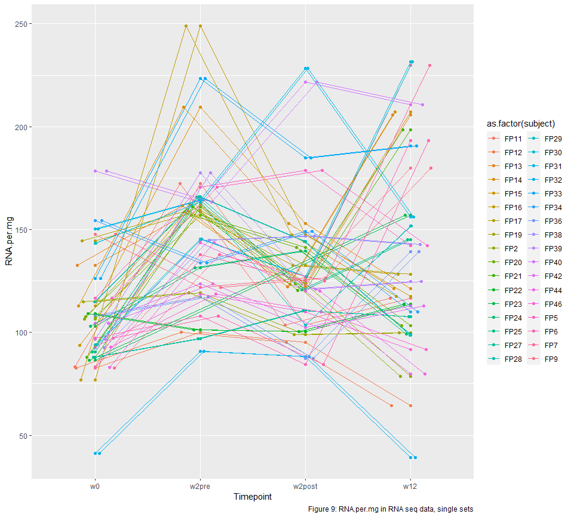
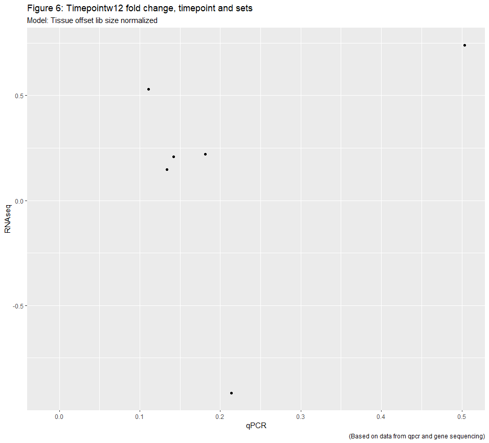
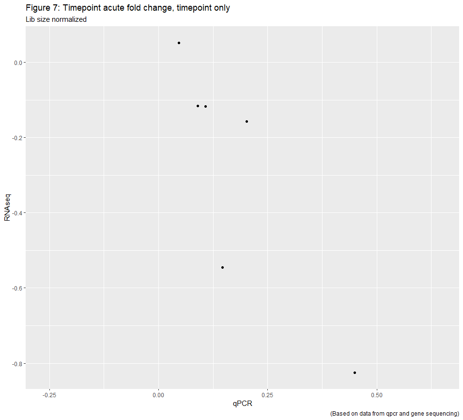
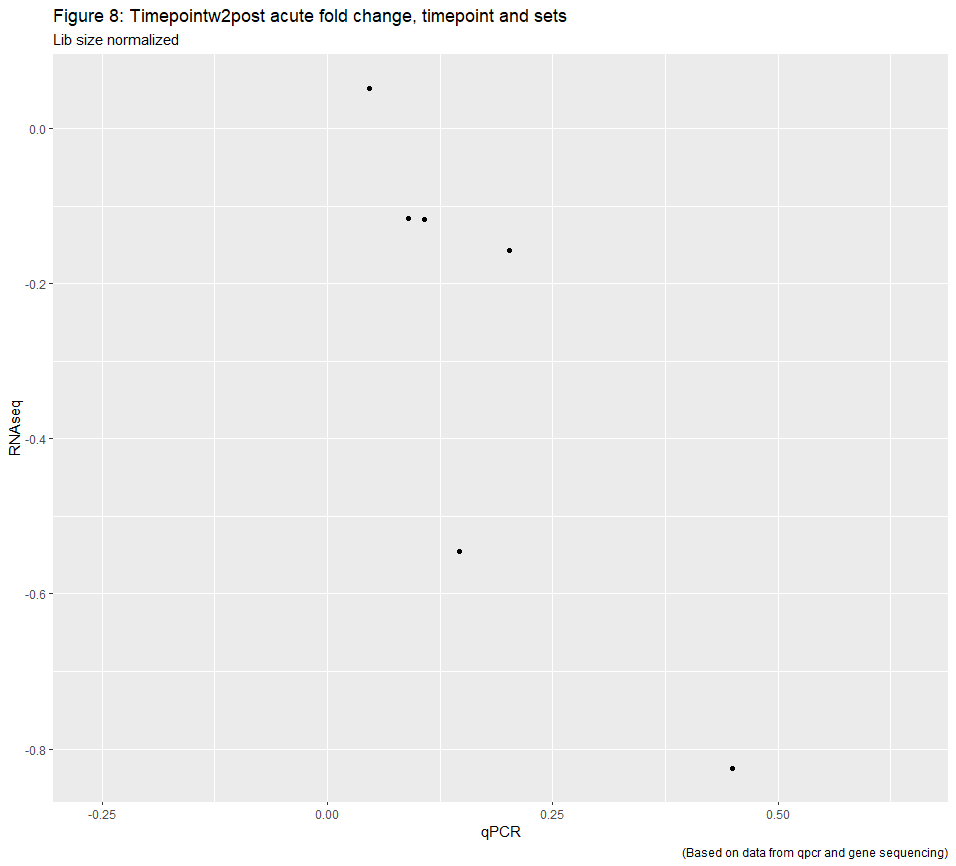
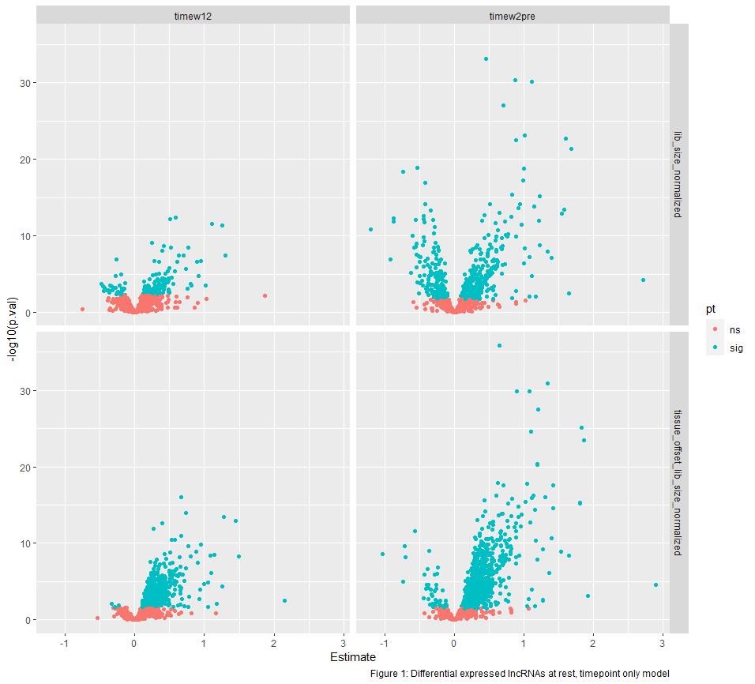
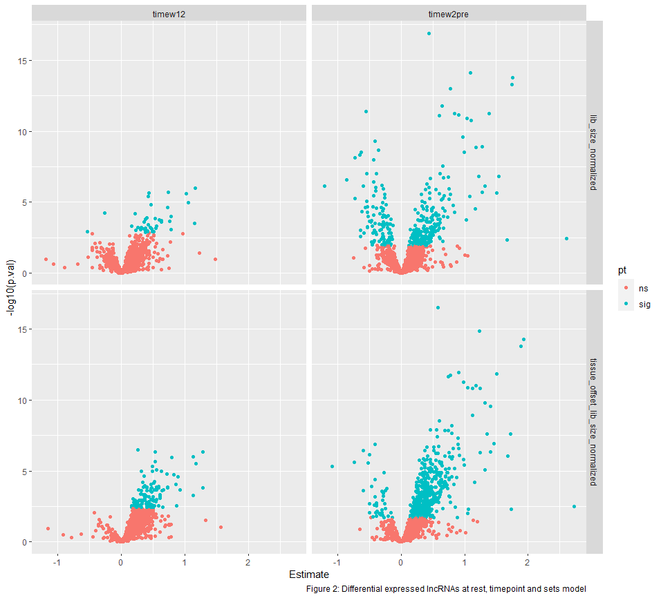
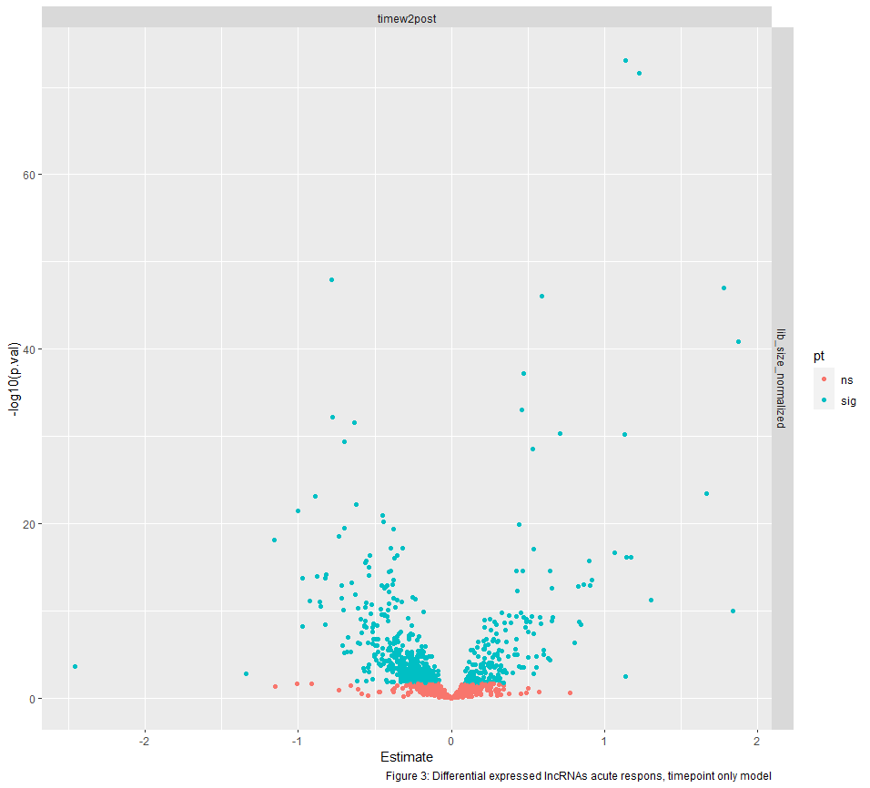
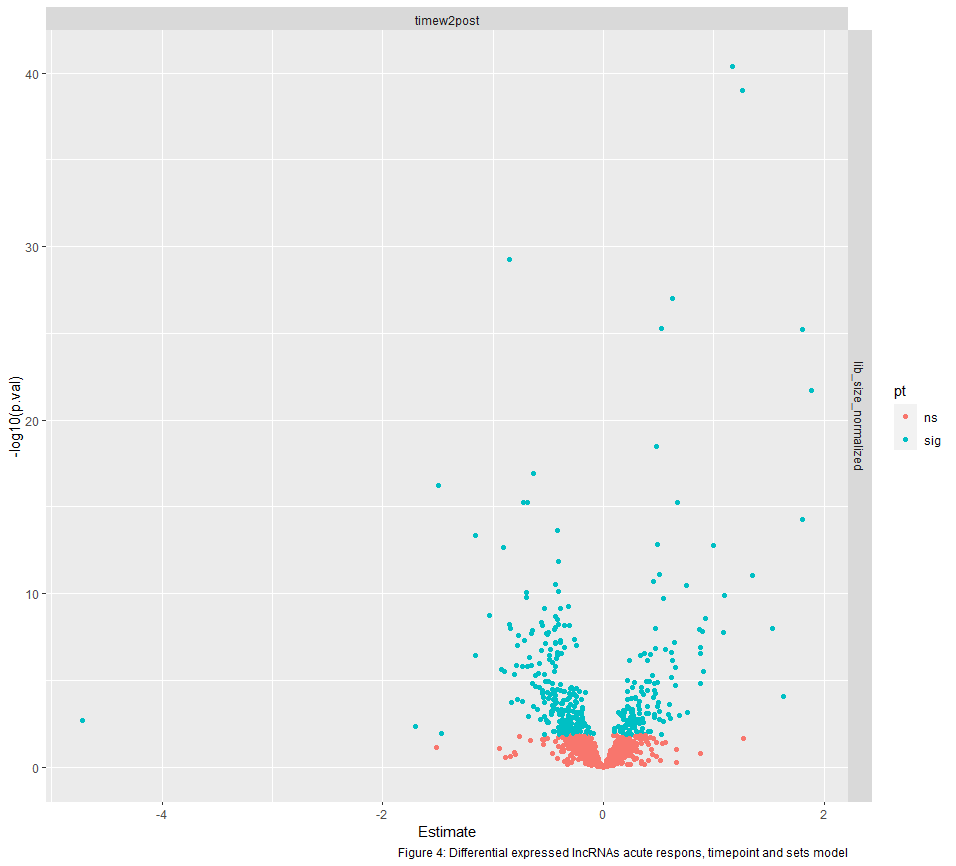

\pagebreak

# Acknowledgement

\pagebreak

# Abstract

#### Title

#### Intention
#### Research question 

#### Method
#### Results 
#### Conclusion 
#### Keywords 

\pagebreak

# Abbreviations

lncRNA Long non coding RNA 
quantitative /real time polymerase chain reaction (qPCR)
MPS Muscle protein synthesis
mTOR Mammalian target of rapamycin   
mTORC1 Mammalian target of rapamycin complex 1   
mTORC2 Mammalian target of rapamycin complex 2   

Differentially expressed (DE)

\pagebreak

# 1. Theory

Humans are made for movement, and prolonged exercise training can enhance human exercise performance and help to maintain good health. Proper function of skeletal muscles are important for every aspect in life. Athletes need strong and enduring muscles to perform their best in competitions. Elderly people need strong muscles in the extremities to be able to walk across the road on green light, and to ascend stairs. Strong leg muscles are also important to prevent loss of balance and injury. When the muscles are exposed to mechanical stimuli, they adapt and becomes stronger or more persevering. Usually one tries to induce mechanical stimuli to the muscles with strength training. There are a vast number of different strength training programs and methods, but the two main variables are volume and intensity **kilde**. Volume is about sets, repetitions and number of training bouts. Intensity, on the other hand, is about load, speed and time. The training intensity is closely connected to increased muscle strength, and usually one finds large increase in muscle strength after high intensity training studies. How many sets and repetitions to apply, are a never ending discussion. The most used volume variables when performing strength training are probably 3 sets and 8-12 repetitions. The latter is a good starting point, but with manipulation of the volume variables one can gain even more muscle strength. What it all boils down to, is that musclegrowth and strength gain is highly correlated with the choices you do regarding volume and intensity. Much is known about the different strength training methods and how to maximize strength and muscle gain. Tailormade strength training bouts are big business, and are used for athletes, rehabilitation patients and exercisers alike. BUt little is known about what really happens when the muscle adapts to training. What are the rationales behind the small bashful changes in RNA expression, protein translation and other similar processes.


Different signalling pathways that leads to muscle adaptation after strength training have been identified. One of the most important to strength training adaptations is mammalian target of rapamycin (mTOR) **KIlde**. MTOR is a part of the phosphatidylinositol 3-kinase-related kinase family and has two distinct multi-protein complexes mtor c1 and c2. The former is recognized as the one most important to muscle adaptation. **KILDE**. We don't know much about the function of mtorc2, but it looks like it may be associated with the ribosome and regulating ribosomal activity, and cell survival **KILDE**.mTORC1 is targeting different signalling pathways and proteins, and is probably very important for muscle protein synthesis (MPS) **KILDE**. 

**Akt signaling pathway**


The Akt Pathway, or PI3K-Akt Pathway is a signal transduction pathway that promotes survival and growth in response to extracellular signals. Key proteins involved are PI3K (phosphatidylinositol 3-kinase) and Akt (Protein Kinase B).

Initial stimulation by one of the growth factors causes activation of a cell surface receptor and phosphorylation of PI3K. Activated PI3K then phosphorylates lipids on the plasma membrane, forming second messenger phosphatidylinositol (3,4,5)-trisphosphate (PIP3). Akt, a serine/threonine kinase, is recruited to the membrane by interaction with these phosphoinositide docking sites, so that it can be fully activated.[1] Activated Akt mediates downstream responses, including cell survival, growth, proliferation, cell migration and angiogenesis, by phosphorylating a range of intracellular proteins. The pathway is present in all cells of higher eukaryotes and is highly conserved.[2]

The pathway is highly regulated by multiple mechanisms, often involving cross-talk with other signalling pathways. Problems with PI3K-Akt pathway regulation can lead to increase in signalling activity. This has been linked to a range of diseases such as cancer and type II diabetes. A major antagonist of PI3K activity is PTEN (phosphatase and tensin homolog), a tumour suppressor which is often mutated or lost in cancer cells. Akt phosphorylates as many as 100 different substrates, leading to a wide range of effects on cells.[3]

The Akt-PI3K pathway is essential for cell survival as activated Akt influences many factors involved in apoptosis, either by transcription regulation or direct phosphorylation. [5] In the nucleus, Akt inhibits transcription factors that promote the expression of cell death genes, and enhances transcription of anti-apoptotic genes. A well studied example is the Forkhead family transcription factors (FoxO/FH), of which FKHR/FoxO1, FKHRL1/FoxO3 and AFX/FoxO4 are directly phosphorylated by Akt.[12][25] This phosphorylation induces export to the cytosol where they are sequestered by 14-3-3 proteins and eventually undergo degradation via the ubiquitin-proteasome pathway.[2][26]

Akt also positively regulates some transcription factors to allow expression of pro-survival genes. Akt can phosphorylate and activate the IκB kinase IKKα, causing degradation of IκB and nuclear translocation of NF-κB where it promotes expression of caspase inhibitors, c-Myb and Bcl-xL.[2][12] Also promoting cell survival, cAMP response element binding protein (CREB) is phosphorylated by Akt at Ser133, stimulating recruitment of CREB-binding protein (CBP) to the promoter of target genes, such as Bcl-2.[27] Akt has also been shown to phosphorylate murine double minute 2 (Mdm2), a key regulator of DNA damage responses, at Ser166 and Ser186. Phosphorylation of Mdm2 by Akt upregulates its ubiquitin-ligase activity, therefore indirectly suppressing p53-mediated apoptosis.[25] Another target of Akt is the Yes-associated protein (YAP), phosphorylated at Ser127 leading to 14-3-3 binding and cytosolic localisation. Therefore, it cannot co-activate p73-mediated apoptosis in response to DNA damage.[28]

Akt negatively regulates pro-apoptotic proteins by direct phosphorylation. For example, phosphorylation of BAD, the Bcl-2 family member, on Ser136 causes translocation from the mitochondrial membrane to the cytosol, where it is sequestered by 14-3-3 proteins.[27] Akt phosphorylates Caspase-9 on Ser196, preventing a caspase cascade leading to cell death.[2][12] Akt also phosphorylates MAP kinase kinase kinases (MAPKKK) upstream of the stress-activated protein kinase (SAPK) pathway. Phosphorylation of apoptosis signal-regulating kinase 1 (ASK1) on Ser83 and mixed lineage kinase 3 (MLK3) on Ser674 inhibits their activity and prevents MAP kinase induced apoptosis.[25]

##### lkafløfø


**MAPK signaling patway**


Overall, the extracellular mitogen binds to the membrane receptor. This allows Ras (a Small GTPase) to swap its GDP for a GTP. It can now activate MAP3K (e.g., Raf), which activates MAP2K, which activates MAPK. MAPK can now activate a transcription factor, such as Myc. In more detail:

Ras activation
Receptor-linked tyrosine kinases such as the epidermal growth factor receptor (EGFR) are activated by extracellular ligands, such as epidermal growth factor (EGF). Binding of EGF to the EGFR activates the tyrosine kinase activity of the cytoplasmic domain of the receptor. The EGFR becomes phosphorylated on tyrosine residues. Docking proteins such as GRB2 contain an SH2 domain that binds to the phosphotyrosine residues of the activated receptor.[2] GRB2 binds to the guanine nucleotide exchange factor SOS by way of the two SH3 domains of GRB2. When the GRB2-SOS complex docks to phosphorylated EGFR, SOS becomes activated.[3] Activated SOS then promotes the removal of GDP from a member of the Ras subfamily (most notably H-Ras or K-Ras). Ras can then bind GTP and become active.

Apart from EGFR, other cell surface receptors that can activate this pathway via GRB2 include Trk A/B, Fibroblast growth factor receptor (FGFR) and PDGFR.

Kinase cascade
Activated Ras activates the protein kinase activity of RAF kinase.[4] RAF kinase phosphorylates and activates MEK (MEK1 and MEK2). MEK phosphorylates and activates a mitogen-activated protein kinase (MAPK).

RAF, and ERK (also known as MAPK) are both serine/threonine-selective protein kinases. MEK is a serine/tyrosine/threonine kinase.

In the technical sense, RAF, MEK, and MAPK are all mitogen-activated kinases, as is MNK (see below). MAPK was originally called "extracellular signal-regulated kinases" (ERKs) and "microtubule associated protein kinase" (MAPK). One of the first proteins known to be phosphorylated by ERK was a microtubule-associated protein (MAP). As discussed below, many additional targets for phosphorylation by MAPK were later found, and the protein was renamed "mitogen-activated protein kinase" (MAPK). The series of kinases from RAF to MEK to MAPK is an example of a protein kinase cascade. Such series of kinases provide opportunities for feedback regulation and signal amplification.

Regulation of translation and transcription
Three of the many proteins that are phosphorylated by MAPK are shown in the Figure. One effect of MAPK activation is to alter the translation of mRNA to proteins. MAPK phosphorylates 40S ribosomal protein S6 kinase (RSK). This activates RSK, which, in turn, phosphorylates ribosomal protein S6.[5] Mitogen-activated protein kinases that phosphorylate ribosomal protein S6 were the first to be isolated.[4]

MAPK regulates the activities of several transcription factors. MAPK can phosphorylate C-myc. MAPK phosphorylates and activates MNK, which, in turn, phosphorylates CREB. MAPK also regulates the transcription of the C-Fos gene. By altering the levels and activities of transcription factors, MAPK leads to altered transcription of genes that are important for the cell cycle.

The 22q11, 1q42, and 19p13 genes are associated with schizophrenia, schizoaffective, bipolar, and migraines by affecting the ERK pathway.


MAP Kinase Pathways.
Regulation of cell cycle entry and proliferation
Role of mitogen signaling in cell cycle progression The ERK pathway plays an important role of integrating external signals from the presence of mitogens such as epidermal growth factor (EGF) into signaling events promoting cell growth and proliferation in many mammalian cell types. In a simplified model, the presence of mitogens and growth factors trigger the activation of canonical receptor tyrosine kinases such as EGFR leading to their dimerization and subsequent activation of the small GTPase Ras.[6] This then leads to a series of phosphorylation events downstream in the MAPK cascade (Raf-MEK-ERK) ultimately resulting in the phosphorylation and activation of ERK. The phosphorylation of ERK results in an activation of its kinase activity and leads to phosphorylation of its many downstream targets involved in regulation of cell proliferation. In most cells, some form of sustained ERK activity is required for cells to activate genes that induce cell cycle entry and suppress negative regulators of the cell cycle. Two such important targets include Cyclin D complexes with Cdk4 and Cdk6 (Cdk4/6) which are both phosphorylated by ERK.[7] The transition from G1 to S phase is coordinated by the activity of Cyclin D-Cdk4/6, which increases during late G1 phase as cells prepare to enter S-phase in response to mitogens. Cdk4/6 activation contributes to hyper-phosphorylation and the subsequent destabilization of retinoblastoma protein (Rb).[7] Hypo-phosphorylated Rb, is normally bound to transcription factor E2F in early G1 and inhibits its transcriptional activity, preventing expression of S-phase entry genes including Cyclin E, Cyclin A2 and Emi1.[6] ERK1/2 activation downstream of mitogen induced Ras signaling is necessary and sufficient to remove this cell cycle block and allow cells to progress to S-phase in most mammalian cells.


Schematic of mitogen input integrated into the cell cycle
Downstream feedback control and generation of a bistable G1/S switch

Growth and mitogen signals are transmitted downstream of the ERK pathway are incorporated into multiple positive feedback loops to generate a bistable switch at the level of E2F activation.[8] This occurs due to three main interactions during late G1 phase. The first is a result of mitogen stimulation though the ERK leading to the expression of the transcription factor Myc, which is a direct activator of E2F.[7] The second pathway is a result of ERK activation leading to the accumulation of active complexes of Cyclin D and Cdk4/6 which destabilize Rb via phosphorylation and further serve to activate E2F and promote expression of its targets. Finally, these interactions are all reinforced by an additional positive feedback loop by E2F on itself, as its own expression leads to production of the active complex of Cyclin E and CDK2, which further serves to lock in a cell's decision to enter S-phase. As a result, when serum concentration is increased in a gradual manner, most mammalian cells respond in a switch-like manner in entering S-phase. This mitogen stimulated, bistable E2F switch is exhibits hysteresis, as cells are inhibited from returning to G1 even after mitogen withdrawal post E2F activation.[9]

Dynamic signal processing by the ERK pathway
Single cell imaging experiments have shown ERK to be activated in stochastic bursts in the presence of EGF. Furthermore, the pathway has been shown to encode the strength of signaling inputs though frequency modulated pulses of its activity.[9] Using live cell FRET biosensors, cells induced with different concentrations of EGF illicit activity bursts of different frequency, where higher levels of EGF resulted in more frequent bursts of ERK activity. Furthermore, the dynamics of ERK activation in response to mitogens were found to be relevant for unique downstream responses including timing of S-phase entry in MCF10A cells.[9] Various types of growth factors can also lead to unique ERK dynamics in other cell types effecting cell fate, suggesting the temporal dynamics of ERK activation is a general means of encoding unique gene expression programs by cells.[10][11]

Integration of mitogen and stress signals in proliferation

Recent live cell imaging experiments in MCF10A and MCF7 cells have shown that a combination of mitogen signaling though ERK and stress signals through activation of p53 in mother cells contributes to the likelihood of whether newly formed daughter cells will immediately re-enter the cell cycle or enter quiescence (G0) preceding mitosis.[12] Rather than daughter cells starting with no key signaling proteins after division, mitogen/ERK induced Cyclin D1 mRNA and DNA damage induced p53 protein, both long lived factors in cells, can be stably inherited from mother cells after cell division. The levels of these regulators vary from cell to cell after mitosis and stoichiometry between them strongly influences cell cycle commitment though activation of Cdk2. Chemical perturbations using inhibitors of ERK signaling or inducers p53 signaling in mother cells suggest daughter cells with high levels of p53 protein and low levels of Cyclin D1 transcripts were shown to primarily enter G0 whereas cells with high Cyclin D1 and low levels of p53 are most likely to reenter the cell cycle. These results illustrate a form of encoded molecular memory though the history of mitogen signaling through ERK and stress response though p53.[13][14]


### kgkgk


Translation of ribosome and the making of proteins is the key to muscle growth. Translation depends on two variables, translation capacity and translation efficiency. Translation capacity is all about how many ribosome are available, tRNA and translation factors **KIlde [Chaillou2014]**. And translation efficiency is how efficient the ribosome does the protein synthesis **KILDE**. Increase in the latter is likely one of the main variables  behind elevated MPS as a response to strength training. **KIlde[@O'Neil2009]**.


**Sattelitecell proliferation**
Myosatellite cells, also known as satellite cells or muscle stem cells, are small multipotent cells with very little cytoplasm found in mature muscle.[1] Satellite cells are precursors to skeletal muscle cells, able to give rise to satellite cells or differentiated skeletal muscle cells.[2] They have the potential to provide additional myonuclei to their parent muscle fiber, or return to a quiescent state.[3] More specifically, upon activation, satellite cells can re-enter the cell cycle to proliferate and differentiate into myoblasts.[4]

Myosatellite cells are located between the basement membrane and the sarcolemma of muscle fibers,[5] and can lie in grooves either parallel or transversely to the longitudinal axis of the fibre. Their distribution across the fibre can vary significantly. Non-proliferative, quiescent myosatellite cells, which adjoin resting skeletal muscles, can be identified by their distinct location between sarcolemma and basal lamina, a high nuclear-to-cytoplasmic volume ratio, few organelles (e.g. ribosomes, endoplasmic reticulum, mitochondria, golgi complexes), small nuclear size, and a large quantity of nuclear heterochromatin relative to myonuclei. On the other hand, activated satellite cells have an increased number of caveolae, cytoplasmic organelles, and decreased levels of heterochromatin.[2] Satellite cells are able to differentiate and fuse to augment existing muscle fibers and to form new fibers. These cells represent the oldest known adult stem cell niche, and are involved in the normal growth of muscle, as well as regeneration following injury or disease.

In undamaged muscle, the majority of satellite cells are quiescent; they neither differentiate nor undergo cell division. In response to mechanical strain, satellite cells become activated. Activated satellite cells initially proliferate as skeletal myoblasts before undergoing myogenic differentiation.[1]

Genetic markers
Satellite cells express a number of distinctive genetic markers. Current thinking is that most satellite cells express PAX7 and PAX3.[6] Satellite cells in the head musculature have a unique developmental program,[7] and are Pax3-negative. Moreover, both quiescent and activated human satellite cells can be identified by the membrane-bound neural cell adhesion molecule (N-CAM/CD56/Leu-19), a cell-surface glycoprotein. Myocyte nuclear factor (MNF), and c-met proto-oncogene (receptor for hepatocyte growth factor (HGF)) are less commonly used markers.[2]

CD34 and Myf5 markers specifically define the majority of quiescent satellite cells.[8] Activated satellite cells prove problematic to identify, especially as their markers change with the degree of activation; for example, greater activation results in the progressive loss of Pax7 expression as they enter the proliferative stage. However, Pax7 is expressed prominently after satellite cell differentiation.[9] Greater activation also results in increased expression of myogenic basic helix-loop-helix transcription factors MyoD, myogenin, and MRF4 – all responsible for the induction of myocyte-specific genes.[10] HGF testing is also used to identify active satellite cells.[2] Activated satellite cells also begin expressing muscle-specific filament proteins such as desmin as they differentiate.

The field of satellite cell biology suffers from the same technical difficulties as other stem cell fields. Studies rely almost exclusively on Flow cytometry and fluorescence activated cell sorting (FACS) analysis, which gives no information about cell lineage or behaviour. As such, the satellite cell niche is relatively ill-defined and it is likely that it consists of multiple sub-populations.

Function
Muscle repair
When muscle cells undergo injury, quiescent satellite cells are released from beneath the basement membrane. They become activated and re-enter the cell cycle. These dividing cells are known as the "transit amplifying pool" before undergoing myogenic differentiation to form new (post-mitotic) myotubes. There is also evidence suggesting that these cells are capable of fusing with existing myofibers to facilitate growth and repair.[1]

The process of muscle regeneration involves considerable remodeling of extracellular matrix and, where extensive damage occurs, is incomplete. Fibroblasts within the muscle deposit scar tissue, which can impair muscle function, and is a significant part of the pathology of muscular dystrophies.

Satellite cells proliferate following muscle trauma[11] and form new myofibers through a process similar to fetal muscle development.[12] After several cell divisions, the satellite cells begin to fuse with the damaged myotubes and undergo further differentiations and maturation, with peripheral nuclei as in hallmark.[12] One of the first roles described for IGF-1 was its involvement in the proliferation and differentiation of satellite cells. In addition, IGF-1 expression in skeletal muscle extends the capacity to activate satellite cell proliferation (Charkravarthy, et al., 2000), increasing and prolonging the beneficial effects to the aging muscle. [13] [14]

Effects of exercise
Satellite cell activation is measured by the extent of proliferation and differentiation. Typically, satellite cell content is expressed per muscle fiber or as a percentage of total nuclear content, the sum of satellite cell nuclei and myonuclei. While the adaptive response to exercise largely varies on an individual basis on factors such as genetics, age, diet, acclimatization to exercise, and exercise volume, human studies have demonstrated general trends.[2]

It is suggested that exercise triggers the release of signaling molecules including inflammatory substances, cytokines and growth factors from surrounding connective tissues and active skeletal muscles.[2] Notably, HGF, a cytokine, is transferred from the extracellular matrix into muscles through the nitric-oxide dependent pathway. It is thought that HGF activates satellite cells, while insulin-like growth factor-I (IGF-1) and fibroblast growth factor (FGF) enhance satellite cell proliferation rate following activation.[15] Studies have demonstrated that intense exercise generally increases IGF-1 production, though individual responses vary significantly.[16][17] More specifically, IGF-1 exists in two isoforms: mechano growth factor (MGF) and IGF-IEa.[18] While the former induces activation and proliferation, the latter causes differentiation of proliferating satellite cells.[18]

Human studies have shown that both high resistance training and endurance training have yielded an increased number of satellite cells.[9][19] These results suggest that a light, endurance training regimen may be useful to counteract the age-correlated satellite cell decrease.[2] In high-resistance training, activation and proliferation of satellite cells are evidenced by increased cyclin D1 mRNA, and p21 mRNA levels. This is consistent with the fact that cyclin D1 and p21 upregulation correlates to division and differentiation of cells.[3]

Satellite cell activation has also been demonstrated on an ultrastructural level following exercise. Aerobic exercise has been shown to significantly increase granular endoplasmic reticulum, free ribosomes, and mitochondria of the stimulated muscle groups. Additionally, satellite cells have been shown to fuse with muscle fibers, developing new muscle fibers.[20] Other ultrastructural evidence for activated satellite cells include increased concentration of Golgi apparatus and pinocytotic vesicles.[21]

Research
Upon minimal stimulation, satellite cells in vitro or in vivo will undergo a myogenic differentiation program.

Unfortunately, it seems that transplanted satellite cells have a limited capacity for migration, and are only able to regenerate muscle in the region of the delivery site. As such, systemic treatments or even the treatment of an entire muscle in this way is not possible. However, other cells in the body such as pericytes and hematopoietic stem cells have all been shown to be able to contribute to muscle repair in a similar manner to the endogenous satellite cell. The advantage of using these cell types for therapy in muscle diseases is that they can be systemically delivered, autonomously migrating to the site of injury. Particularly successful recently has been the delivery of mesoangioblast cells into the Golden Retriever dog model of Duchenne muscular dystrophy, which effectively cured the disease.[22] However, the sample size used was relatively small and the study has since been criticized for a lack of appropriate controls for the use of immunosuppressive drugs. Recently, it has been reported that Pax7 expressing cells contribute to dermal wound repair by adopting a fibrotic phenotype through a Wnt/β-catenin mediated process.[23]

Regulation
Little is known of the regulation of satellite cells. Whilst together PAX3 and PAX7 currently form the definitive satellite markers, Pax genes are notoriously poor transcriptional activators. The dynamics of activation and quiesence and the induction of the myogenic program through the myogenic regulatory factors, Myf5, MyoD, myogenin, and MRF4 remains to be determined.

There is some research indicating that satellite cells are negatively regulated by a protein called myostatin. Increased levels of myostatin up-regulate a cyclin-dependent kinase inhibitor called p21 and thereby inhibit the differentiation of satellite cells.[24]


##### ahljdæhkagdk


RNa is a messenger between DNA and proteins. But in the transcriptional process a lot of non protein coding RNAs are produced [@Ponting2009]. One interesting transcript species are long non coding RNAs (lncRNAs). They are a bit of a mystery. For a long time they were solely regarded as transcriptional noise, but recently they are found interesting. **kilde**. The lncRNAs, as the name implies, is made up of over 200 nucleotides [@Ponting2009]. Some of the lncRNAs can alter the coding gene by pairing with mRNA **kilde[@Wang2016]**, and other can interact with microRNAs and  make them miss their target mRNA **kilde[@Cesana2011]**. Yet another group of lncRNAs can encode micropetides that are shorter than 100 amino acids and by doing that alter the micropeptide induced functions **kilde[@Anderson2015]**. Lncrnas have a hefty toolbox to use, and most of the lncs directly linked to myogenesis acts as transcriptional or epigenetic regulators [@Li2018].

**linc lncs to pathways**


Little is known of their function and the evidence for lncRNAs function is scarce. But due to more advanced research methods the recent years, many lncRNAs has been identified and annotated. **hot research topic** LncRNAs and their implication on muscle adaptation to strength training may be vast. Some is known, and cancer research advocates more research on lncRNAs. Especially the ones that are connected to tumor growth **KILDE**. Little is kown about the lncRNAs role in skeletal muscle adaptation to strength training. **maybe som in ice studies** But in human skeletal muscle, the knowledge is scarce, if any. 


## 1.1 Training volume and muscle growth
**Muskelvekst og treningsvolum (kan evt gjøres til to underdelkap – mulig rekkefølgen bør byttes om). Her skal du først få frem at det er et tydelig forhold mellom muskelvekst og treningsvolum. Fremhev at dette lenge var usikkert, men at meta-analyse viser dette – få deretter frem at dette er tydelig i intrabiologiskemodeller (og hvorfor). Hvorfor **


Intensiteten på styrketreningen har en klar sammenheng med økningen i muskelstyrke. Treningsintensiteten har vært over 80 % av 1RM i de studiene som viser størst økning i muskelstyrke (Hunter et al., 2004; Latham et al., 2003; Liu & Latham, 2009). En ser en hypertrofi av type II muskelfibre ved høyintensitetstrening, mens type I muskelfibre påvirkes mest ved lavere intensitet (Sletvold, 2007). Lengden på intervensjonsperioden spiller også inn på økningen i muskelstyrke. Raastad et al. (2010) hevder at i hovedsak skyldes styrkeøkningen de første ukene, nevral adaptasjon. Det er uvisst akkurat hvor lenge nevral adaptasjon er hovedårsaken, men som regel snakker en om opptil fire uker. Deretter følger en periode med hypertrofi, og en bør derfor ha en intervensjonsperiode på minst 10 uker for å se en reell styrkeøkning (ibid).

We adapt to training and human skeletal muscles are capable of an exceptional plasticity. Contraction induced changes, calcium flux, redox balance, reactive oxygen species (ROS). In total a cascade of signal transduction.

Strength training induces mechanical stimuli to skeletal muscles **Kilde** and the muscle adapts, among others, by adding sarcomeres in parallel in muscle fibres**Kilde**. Strength training results in neural adaptations, improved strength, alter muscle phenotype. and increased cross sectional area (CSA) of the muscle fiber **KILDE[@Staron1990]**. INcreased RFD (rate of increase in force at the contraction onset)  **KILDE**. Other adaptations to strength training is increased CSA, specially IIa fibres, increase in noncontractile tissue, e.g collagen, and change in muscle fibers angle of pennation. **KILDE**Adaptations to strength training shows after 8-12 weeks of repeated training**[@Folland2007]**. Over time, the strength gain will be more due to muscle growth than neural adaptations **kilde**. There will be an increase in muscle net protein synthesis (MPS) **KIlde [@Damas2015]**. MPS is increased due to lower protein degradation and higher, maybe more efficient, protein synthesis **kilde[@Phillips1997]**

Beginners have low hypertrophy effect from strength training, and the strength gain mostly comes from neural adaptations to muscle activation **kilde**. Adaptation to strength training is an individual response and everything are not identified or understood yet. What is known, is that one can vary load and volume to target either CSA or neuromuscular drive **KILDE**. One usually vary the load between 1RM and 10RM, and the volume between 4-12 repetitions.

The central neural component is important for muscle adaptations due to strength training, especially with unilateral training. With the latter the CSA in the untrained leg does not change, but one can observe an increase in strength **KILDE[@Munn2004]**.


## 1.2 Cellular pathways
**fokus på cellulære pathways som antas å kontrollere muskelvekst (ie. Gjennom reg av translasjon og satelittcelleprolif) – her skal du konsentrere deg om pathways som senere skal brukes aktivt i diskusjon rundt betydningene av LNCs – du skal altså etablere en rød tråd – informasjonen begrenses således til generell oversikt samt perspektiver som påvirkes av LNCs**


Increase in mRNA expression after bout of strength training, drives protein synthesis of specific proteins **Barres et al. KILDE**
adaptive hypertrophy mainly driven by MPS (muscle protein synthesis) after activation of mTOR, ribosomal protein S6K (p70) and downstream variables **KILDE[@Bodine2001])**.


mTorC1 activity is regulated by several upstream regulators. One of them is phosphoinositide 3-kinase (PI3K), that again regulates protein kinase B (Akt) **KILDE[@Bodine2001]**. Mechanical stimuli leads to that Insulin-like growth factor 1 (IGF-1) binds to receptors in the cell membrane, and this initiate stimulation of PI3K- and Akt-activity **KILDE[@McCarthy2010]** AKT phosporylates downstream effectors and that activates G-protein Rheb (Ras-homolog enriched in brain) and that again activates mTORC1 

Amino acids and mechanical stimuli upregulates mtorc1. **KILDE**
mTORC1 phosphorylates 4E-BP1 and S6K1 which eventually leads to enhanced protein synthesis **KILDE**

Increase in mtorc1 activity after strength training -> signalling through a P13K/Akt independent RXRxxS/T kinase **KILDE**

Rapamycin binds to the FKBP12-rapamycin binding domain (FRB) and by doing that inhibits mtorc1. That results in inhibited cell proliferation and muscle hypertrophy.  **KILDE**

Mtorc1 is said to be driving the ribosomal biogenesis, but the mechanisme is not yet understood **KILDE**.

 


Ribosomal biogenesis pathways  **ELABORATE** **KILDE**


## 1.3 Long non-coding RNA

•**Delkap 3: LNCs (flere underdelkap? E.g.** 

  
### 1.3.1  
  **o	 LNCs generelt, hva er de? Hvorfor vet vi så lite? Generelle funksjoner og nomenklatur/kategorier**

  
  
  [@Kung2013]

**Some of the first cases of gene-specific regulatory roles of lncRNAs were uncovered in the early 1990s, with the discovery of lncRNAs involved in epigenetic regulation, such as H19 (Brannan et al. 1990) **
  
  **Figure from [@Kung2013] shows some of the lncRNAs functions


LncRNAs can be allocated to five categories:
1) sense, 2) antisense, 3)bidirectional, 4)intronic and 5)intergenic [@Ponting2009].
In category 1 they overlap one or more exons of another exon on the same strand. Category  is the same as 1, except it is one the opposite strand. 3 is when the lncRNA is in close genomic proximity to a coding transcript on the opposite strand. 4 is when it is derived from an intron on a second transcript, and 5 is when it is in the genomic interval between two different genes.
  
### 1.3.2

  **o	LNCs i cellevekst og proliferering (med særlig fokus på muskel utover i underdelkap). Hvilke funksjoner har de i regulering av cellevekst og proliferering (på generelt grunnlag – e.g. fra kreftforskning) - igjen plukker du opp pathways fra foregående delkap)? Hvilke funksjoner har de i muskel, inkl info om totalt uttrykksomfang i dyrestudier og kjente funksjoner for spesifikke LNCs?**
  
 

One has discovered that lncRNAs may regulate satellite cell biology [@Li2018]. Satellite cells are important for muscle regeneration.  If an injury occurs, the satellite cells will be activated and become myoblasts. Pax7 is downregulated and myogenic regulatory factors (MRFs) are activated to start cell differentiation, thereby making new muscle fibers and replenish the damaged muscle cells **kilde[@Kuang2007]**. Another important feature for the lncRNAs is that they play a role in epigenetic and transcriptional regulation of chromatins. The Lncs interacts with chromatins, and may inhibit other transcriptional regulators activities **kilde[@Han2014]**.

Some of the lncRNAs can alter the coding gene by pairing with mRNA **kilde[@Wang2016]**, and other can interact with microRNAs and  make them miss their target mRNA **kilde[@Cesana2011]**. Yet another group of lncRNAs can encode micropetides that are shorter than 100 amino acids and by doing that alter the micropeptide induced functions **kilde[@Anderson2015]**. Lncrnas have a hefty toolbox to use, and most of the lncs directly linked to myogenesis acts as transcriptional or epigenetic regulators [@Li2018].
  
  
  
  
  
  
  
  
  
### 1.3.3  

  **o	hvordan kan vi studerer LNCs in vivo hos mennesker? Først må uttrykksomfanget kartlegges. RNA-seq vs qPCR . Få frem at ikke alle LNCs har poly-A hale, noe som er nødvendig dersom de skal plukkes opp i poly-A drevet RNAseq (poenget er å forberede leseren på at du kun gjenfinner 6 av linkene fra qPCR-exp i RNA-seq datasettet  - dette er en av mulige forklaringer – sekvenseringsdybde er en annen)**
  
  Gene sequencing
Discovery and characterization of lncRNAs has sped up due to the recent years leap in high throughput gene sequencing technology.  

@Sun2016 defined 7692 lncRNAs in bovine skeletal muscle using Ribo_Zero RNA-seq. This sequencing technology can identify both poly A+ and poly A- transcripts. A poly A tail consists of many adenosine monophosphates and helps preventing degradation of mRNA **KIlde** LncRNAs have usually low expression and are highly tissue specific. They usually have a poly A+ or poly A- tail at thee 3' end of the transcript. **kilde[@Cabili2011]**

 High throughput gene sequencing technology [@Reuter2015]
  
  
  Genes used for qPCR **dette må ogspå inn I teorikap. Mitt tips er at du skriver teoridelen først – deretter lager du en compiled variant som fungerer som intro i artikkelen**

GAS5 Growth arrest specific 5, suppression of MYC translation.
LNC310
LNC1405
AK017368
PARROT/LINP1 Positive regulator of ribosomal biogenesis:
positive regulator av c-Myc
PVT1
activated early during muscle atrophy, impacts mitochondrial respiration and morphology and affects mito/autophagy, apoptosis and myofiber size in vivo.
AK021986 Could not find Ensemble ID. Was removed from further analysis. Long noncoding RNA SYISL regulates myogenesis by interacting with polycomb repressive complex 2
RMRP  RNA component of mitochondrial RNA processing endoribonuclease. Transport trough the mitochondrial membrane.
Linc MD1
Regulators of myogenic differentiation/myogenesis/hypertrophy:
activated myoblast differentiation. Depletion downregulates myogenic markers, to highly expressed accumulation of myogenic markers. affect myogenesis by blocking target mRNA for miR-133 and miR-135. no activation mastermind-like transcriptional coactivatore1 (MAML1) and myocyte enhance factor 2C (MEF2C). important transcriptional co activators KILDE (???).
  
  
  
**Ha fokus på å skrive gode avsnitt (på ca ½ side – rettesnor) som forteller en sammenhengende historie – hele introen skal henge sammen**


#Research questions
How many differentially expressed (DE) lncRNAs identified from gene sequencing data pool after strength training bout.
How many DE lncRNAS increases?
How many DE lncRNAS decreases
How many of the <lincs have GO code (gene ontology), annotated
Correlation between qPCR data and seq. data.


\pagebreak

# Introduction
Muscle growth and strength gain, is what one seeks when enduring long hours at the gym lifting heavy weights. But what happens inside the muscle? And why is there a difference between how people adapts to the same strength training. Much is known about how and why one should perform strength training. But wouldn't it be nice if one could predict the muscle adaptations?

Translation, from mRNA to proteins is a fairly straight forward process. But lately one have looked at a sub species called long non coding RNA (lncRNA). LncRNA has been depreciated as nothing more than transcriptional noise. But lately there has been a change towards a more functional approach. LncRNA react different dependent on tissue and cells **kilde**. If it was only ¨noise, then it should be indifferent.

Cancer research has identified and described many different lncRNAs. Especially the ones that are connected to tumor and cell growth. 


In this study 9 intersecting lncRNAs were analysed with qPCR. Gene sequencing data was also obtained and analysed together with qPCR data. Gene sequencing data is an vast pool and this is an exploratory study.  

How many lncRNAs can be identified in human skeletal muscle. And what happens when adapting to training.

### Genes used for qPCR
*GAS5*
Growth arrest specific 5, suppression of MYC translation.

*LNC310*				
				
*LNC1405*


*AK017368*

*PARROT/LINP1*
Positive regulator of ribosomal biogenesis:				
positive regulator av c-Myc				
				

*PVT1* 				
activated early during muscle atrophy, impacts mitochondrial respiration and morphology and affects mito/autophagy, apoptosis and myofiber size in vivo. 


*AK021986* 
Could not find Ensemble ID. Was removed from further analysis.
Long noncoding RNA SYISL regulates myogenesis by interacting with polycomb repressive complex 2				
				
*RMRP *
RNA component of mitochondrial RNA processing endoribonuclease.
Transport trough the mitochondrial membrane.				
				
*Linc MD1*			
Regulators of myogenic differentiation/myogenesis/hypertrophy:				
activated myoblast differentiation. Depletion downregulates myogenic markers, to highly expressed accumulation of myogenic markers. affect myogenesis by blocking target mRNA for  miR-133 and miR-135. no activation mastermind-like transcriptional
coactivatore1 (MAML1) and myocyte enhance factor 2C
(MEF2C). important transcriptional co activators **KILDE [@Shen2006]**.

 linc-MD1 is reported to influence the mRNA levels of miRNA-targeted muscle differentiation genes [@Cesana2011]

## research questions
How many differentially expressed (DE) lncRNAs identified from gene sequencing data pool after strength training bout.

How many  DE lncRNAS increases?

How many DE lncRNAS decreases

How many of the <lincs have GO code (gene ontology), annotated   

Correlation between qPCR data and seq. data.


# Methods
This study is based on the 1/3 set study completed by Hammarström et al. [@Hammarström2020].


## Ethical approval
Information about potential discomforts and risks associated with the study were given to all the participants and they gave their informed consent before study enrolment. All procedures were performed in accordance to the Declaration of Helsinki. The study design was pre-registered (ClinicalTrials.gov Identifier: NCT02179307) and approved by the local ethics committee at Lillehammer University College, Department of Sport Science (no. 2013-11-22:2).


## Intervention and participants overview **lag figur som viser oversikt over intervensjonen – se hammarstrom et al 2020**


41 female and male participants were recruited to the study. The eligibility criteria were age between 18 and 40 years and non-smoking. The exclusion criteria were impaired muscle strength due to ongoing or previous injury, prescribed medicine that could alter exercise adaptations, more than one strength exercise bout weekly during the last 12 months or local anaesthetic intolerance. 7 participants were excluded during data analysis due to different reasons. Details can be found in Hammarstroms article **KILDE**
  The intervention was made up by 12 weeks of full-body strength training.
Within-participants differentiation of training volume was achieved by doing unilaterally leg exercises. The strength-training consisted of one set and three set exercises, and the exercise was randomly allocated to the participants two legs. Assessment of muscle strength was performed at baseline and week 3, 5, 9 and after the intervention. Body composition was assessed before and after the intervention and dietary data was **SELVANGITT** after 4-5 following days after week 6. M.vastus lateralis biopsies were taken at the following 4 different timepoints bilaterally: week 0 (rested state), week 2 (pre-exercise), week 2 (post-exercise, acute-phase) and week 12 (rested state).
The detailed study protocol can be found in Hammarstroms article **KILDE**
 
 

## Training protocol
The training bouts always started with 5 min of ergometer cycling with Borgs RPE 12-14 as a warm up.Thereafter 4 bodyweight exercises (sit-ups, push-ups, back-extensions and squats) with 10 repetitions each. Followed by 10 reps at 50% of 1 repetitions maximum (1RM) for each strength exercise. Thereafter unilateral leg press, leg curl and knee extension either as one set or three sets for the latter. After the lower leg exercises they performed two sets of pull-down, seated rowing or shoulder-press and bench press. The intensity was progressed from 10RM (2 weeks), 8RM (3 weeks) to 7RM (7weeks). The rest period between the latter sets was 90-180 seconds. For more details see Hammarstroms article **KILDE**


## Muscle biopsies
The muscle biopsies were taken, within 10 minutes, bilaterally from m. vastus lateralis using a spring-loaded biopsy instrument (Bard Magnum, Bard, Rud, Norway) with a 12-gauge needle (Universal-plus, Medax, San Possidonio, Italy). Local anaesthetics (Xylocaine, 10 mg ml−1 with adrenaline 5µgml−1, AstraZeneca AS,Oslo,Norway) was used during the latter protocol. The resting samples were taken after a standardised meal, at the same timepoint in the morning. Biopsies pre exercise (5 session) was taken 2 days after the 4th session. Post exercise biopsies were taken 3-6 days after intervention ended. Patella and spina iliaca anterior superior (SIAS) was used as landmarks, and the first biopsy was taken from 1/3 of the latter distance. Consecutive biopsies were taken 2 cm proximal to the latter sample. Ice cold saline solution (0,9%) was used when dissecting the muscle samples free from connective tissue and blood. Thereafter 15mg muscle tissue were moved to 4% formalin solution for later immunohistochemistry testing. The muscle tissue (60 mg) that were to be used in RNA- and protein-analysis were quickly frozen in isopentane and stored at -80 degrees Celsius   


## Total RNA extraction
RNA extraction was done in accordance with the protocol found in Hammarstrom article **KILDE**

## Quantitative real-time reverse transcription polymerase chain reaction (QPCR)
The protocol was done in accordance to the protocol from **KILDE**
The qPCR was done with a qPCR machine (Applied Biosystems 7500 fast Real-Time PCR Systems, Life Technologies AS). Used 384 well plates filled with total 10 µl solution. The latter consisting of 2 µl cDNA, specific primers (Forward and Reverse, total 1µl), H20 and a prepared master mix (2X SYBR Select Master Mix, Applied Biosystems, Life Technologies AS). The qPCR protocol was 40 cycles (3 s 95°C denaturing and 30 s 60°C annealing)**?**
Primertest were performed and the primers with the best melt-curves was selected (single product amplification)

### Overview of primers used.

Parrot_F1R1/LINP1 annotated with LINP1

AKO21986_F3R3 was sorted out because does not have ensemble number.


```{r data, include=FALSE, echo=FALSE}
library(tidyverse)
library(readxl)
library(knitr)
library(dplyr)
library(biomaRt)
library(kableExtra)
library(lme4)
library(flextable)

primers_all <- read_excel("./data/primers_all.xlsx", na = "NA")


#First steps, decide what data to use and summarise
#Before we can start to format the table, we need to decide what data to #put in it. The goal here is to create a summary table of primer #characteristics. .
#Store in a new object, so that the raw data can be used later.


pri <- primers_all %>%
  rowwise() 


#Using dplyr::group:by() and dplyr::summarise() we can now create a summary table.

pri <- data.frame(pri) %>%
  ungroup() %>%
  group_by(Ensemble_ID) %>% 
  print()


```


```{r primer_table_all, results ='asis', echo=FALSE}
#The summary table is ready for making a table. In R Markdown chunk settings, we need to set the output format to results = "asis". This will print the table correctly. To create the table, all we need to do is to is to pipe it to kable().
 
 pri %>%
  kable(format = "html", col.names = c("Primers", 
                                       "Ensemble ID",
                                       "Forward primer", 
                                       "Reversed primer"), 
        caption = "Table 1: All primers made for selected genes", align = c("l","l","l", "l")) %>% 
   pack_rows("LincAK017368", 1, 3) %>%
  pack_rows("LincMD1", 4, 6) %>% 
  pack_rows("PARROT/LINP1", 7, 9) %>% 
  pack_rows("GAS5", 10, 12) %>% 
  pack_rows("PVT1", 13, 15) %>% 
  pack_rows("AK021986", 16, 18) %>% 
  pack_rows("RMRP", 19, 21) %>% 
  pack_rows("LNC310", 22, 28) %>% 
  pack_rows("LNC1405", 29, 31) %>% 
 kable_styling(bootstrap_options = "striped", font_size = 12) %>%  
print()
  #add_header_above(c(" " = 1, "Female" = 2, "Male" = 2))   #1, 2 and 2 is the number of cols .


```


# Primers used

```{r primers used, results='asis', echo=FALSE}
prim_u <- read_excel("./data/primers_used.xlsx", na = "NA") %>% 
  dplyr::select(Name, Gene, Forward_primer, Reversed_primer)

prim_u %>% 
  kable(format = "html", col.names = c("Name", 
                                       "Ensemble ID",
                                       "Forward primer",
                                       "Reversed primer"), 
        caption = "Table 2: Primers used", align = c("l","l","l","l")) %>% 
  kable_styling(bootstrap_options = "striped", font_size = 12) %>% 
  print()
```


Primers were designed for all selected long non coding RNAs (LINCs) with Primer3Plus **(Untergasser et al. 2012)** and ordered from Thermo Scientific.

Raw data was exported from the qPCR machine and uploaded to RStudio and analysed with the qpcR-package (Ritz & Spiess, 2008) written for R (R Core Team, 2018). Treshold cycles (Ct) were estimated within the latter. Gene expression data were log-transformed prior to statistical analysis

seq data. Biomart, and other packages.


## Statistics

Mixed-effects negative binomial count models were fitted and saved in 
./R/dge_list_models.R. Results saved in RDS files

-validation seq data
-correlation seq data-qpcr data fold-change, baseline values.

-PCR vs seq data use fold/change mean values

-normalization seq and qpcr data

-linear mixed-effects models (LMMs)

-likelihood-ratio (LHR) tests

-present as mean and SD

-LMMs were fitted using the nlme-package

-statistical significance was set to α = 0.05. 

-All data-analysis was done in R (R Core Team, 2018).

All files and code can be found at github.com "the _MIssing_LINCs

Method paper (Hammarstr��t al 2018), the fixed effects are reduced
to only contain gene-specific time + time:sets


VOLCANO plot


# Results

**gangen gjennom results blir som følger (skriv som sammenhengende historie):**


## RNA sequencing data


```{r lncRNA_identified_seq, echo=FALSE, include=FALSE}

library(tidyverse)
library(readxl)
library(knitr)
library(dplyr)
library(biomaRt)
library(kableExtra)
library(huxtable)
### Find lncRNA from ensamble #########


time_rest <- readRDS("./derivedData/DE/mixedmodel2_timemodel.RDS") #na="NA" tells read_excel how missing values are coded

# Makes a vector of all transcripts (after filtering)
all_genes <- unique(time_rest$gene)


ensembl <- useMart("ensembl")
ensembl <- useDataset("hsapiens_gene_ensembl", mart = ensembl)

# List attributes from biomart
listAttributes(ensembl)

# Make a data frame of all genes with symbol, biotype etc...
all_genes <- getBM(attributes=c('ensembl_gene_id', 'gene_biotype', 'entrezgene_id', 'hgnc_symbol'), 
              filters = 'ensembl_gene_id',
      values = all_genes, 
      mart = ensembl)


###total number of transcripts identified in RNA seq data

all_transcripts <- NROW(all_genes)


## Genes that are also analyzed by qPCR
goi <- c("ENSG00000234741", "ENSG00000268518",  "ENSG00000225613",  "ENSG00000185847",
         "ENSG00000249515",  "ENSG00000223784",  "ENSG00000249859",  "ENSG00000269900")

all_genes %>%
  filter(ensembl_gene_id %in% goi) %>%
  print()


#####lncRNA identified from seq data#####


#### make a data frame of lncRNA 

lncRNA <- data.frame (all_genes, na = "NA") %>%
  filter(gene_biotype == "lncRNA") %>%
  print()


###pull number of lncRNAs identified


lnc_count <- lncRNA %>% 
  nrow() %>%
  print()


###lncRNAs entrezgene_id


e_id <- lncRNA %>% 
  pull(entrezgene_id)

#NROW gives you number of rows. na.omit removes NA.
   
  ent_id_count <- NROW(na.omit(e_id)) %>%
     print()


###lncRNAs used in qPCR analysis found in seq data

goi <- c("ENSG00000234741", "ENSG00000268518",  "ENSG00000225613",  "ENSG00000185847",
         "ENSG00000249515",  "ENSG00000223784",  "ENSG00000249859",  "ENSG00000269900")

qPCR_Lnc <- all_genes %>%
  filter(ensembl_gene_id %in% goi) %>%
  print()

qPCR_Lncs_identf <- qPCR_Lnc %>% 
  nrow() %>%
  print()

```
 
 
 
```{r table all lnc, results='asis', echo=FALSE, include=FALSE}
###make a table of all lncRNAs identified

lncRNA %>% 
dplyr::select(ensembl_gene_id, gene_biotype, entrezgene_id, hgnc_symbol) %>%
  kable(format = "html", col.names = c("Ensemble gene ID", 
                                       "Gene biotype",
                                       "Entrezgene ID", 
                                       "Hgnc symbol"), 
        caption = "Table 3: All lncRNAs  identified", align = c("l",
                "l",
                "l",
                "l")) %>% 
  kable_styling(bootstrap_options = "striped", font_size = 12) %>% 
  print()

```
 


```{r entrezgene_lnc_table, results='asis', echo=FALSE}
###make table of lncs with entrezgene ID

remove_na<- data.frame (lncRNA) 

#na.omit removes NA
entrezgene_id_lnc <- na.omit(remove_na) 


#use select to select wanted variables
entrezgene_id_lnc %>% 
  dplyr::select(ensembl_gene_id, gene_biotype, entrezgene_id, hgnc_symbol) %>%
kable(format = "html", col.names = c("Ensemble gene ID", 
                                     "Gene biotype",
                                     "Entrezgene ID", 
                                     "Hgnc symbol"), 
      caption = "Table 4: All lncRNAs  identified with entrexgene ID", 
      align = c("l",
                "l",
                "l",
                "l")) %>% 
  kable_styling(bootstrap_options = "striped", font_size = 12) %>%  
  print()
```

 **RNA-seq (se oppbygning av results i hammarstrm et al RNA-seq draft**


In total `r (all_transcripts)` were identified in the RNA sequencing data, and `r  (lnc_count)` of them were identified as lncRNAs. LncRNAs were identified with BiomaRT R package and Ensemble ID. With this method is it not possible to find lncRNAs without Ensemble id. The latter applied to AKO21986, one of the qPCR lncRNAs and it was removed from the analysis. 

Only `r (ent_id_count)` of the lncRNAs identified in the gene sequence data have  entrezgene gene id number. Entrezgene ID is needed to perform a gene ontology analysis.**Få frem hva som fører til tildeling av entrezID**

**Får vi til genfunksjonsanalyse – hvis ja, presenter denne for hvert enkelt tidspunkt. Hvis ikke, få frem at dette ble vanskeliggjort av mangelen på entrezID**


#####entrez gene [@Maglott2011]

INTRODUCTIONEntrez Gene is the gene-specific database at the NationalCenter for Biotechnology Information (NCBI), a divisionof the National Library of Medicine, located on the campusof the US National Institutes of Health in Bethesda, MD,USA. Entrez Gene generates unique integers (GeneID)as stable identifiers for genes and other loci for a subsetof model organisms. It tracks those identifiers and usesthem to integrate multiple types of information includingnomenclature, summary descriptions, accessions of gene-specific and gene product-specific sequences, chromosomallocalization, reports of pathways and protein interactions,associated markers and phenotypes. Because the GeneIDis used to represent gene-specific information in otherdatabases at NCBI, the full Entrez Gene report includes awealth  of  links  to  gene-specific  literature  citations,sequences, variations, homologs and databases outside ofNCBI. Entrez Gene is integrated with NCBI’s Entrezsystem for interactive query, Linkout and access byE-Utilities (1).Data in Entrez Gene result from integration of resultsfrom automated analyses and curation by ReferenceSequence project (RefSeq) staff. Gene-specific annotationin sequences from NCBI’s RefSeq (2) or the InternationalNucleotide Sequence Database Collaboration (INSDC)(3) usually serves as the foundation, with value addedby with information from collaborating model organismdatabases, public users and literature review (especiallythe  Gene  References  into  Function  or  GeneRIFssubmitted  by  the  public  and  staff  of  the  NationalLibrary of Medicine). Updates are posted daily, and cor-rections or suggestions are welcomed (http://www.ncbi.nlm.nih.gov/RefSeq/update.cgi


```{r change timepoint high_low volume, echo=FALSE, include=FALSE}

# Load data
# Mixed-effects negative binomial count models were fitted and saved in 
# ./R/dge_list_models.R. Results saved in RDS files (see below).
# no need to run these models again.


full_rest <- readRDS("./derivedData/DE/mixedmodel2_fullmodel.RDS")
full_acute <- readRDS("./derivedData/DE/mixedmodel2_acutemodel.RDS")


##### Find lncRNA from ensamble #########

# Makes a vector of all transcripts (after filtering)
all_genes <- unique(full_rest$gene) 


ensembl <- useMart("ensembl")
ensembl <- useDataset("hsapiens_gene_ensembl", mart = ensembl)

# List attributes from biomart
listAttributes(ensembl)

# Make a data frame of all genes with symbol, biotype etc...
all_genes <- getBM(attributes=c('ensembl_gene_id', 'gene_biotype', 'entrezgene_id', 'hgnc_symbol'), 
                   filters = 'ensembl_gene_id',
                   values = all_genes, 
                   mart = ensembl)

#filter lncRNAs
lncRNA <- all_genes %>%
  filter(gene_biotype == "lncRNA") %>%
  print()


##### Filter and adjust p-values for differentially expression #####

######rest model full #####

lnc_rest <- full_rest %>%
  filter(model %in% c("tissue_offset_lib_size_normalized")) %>% 
         #coef %in% c("(intercept)", "timew2pre", "timew12", "timew0:setsmultiple", "timew2pre:setsmultiple", "timew12:setsmultiple")) %>%
  
  dplyr::select(gene, model, coef, estimate, se, z.val, p.val) %>%
  
  # filter out only lncRNA
  
  filter(gene %in% lncRNA$ensembl_gene_id) %>%
  # P-value adjustments
  group_by(gene, coef) %>%
  mutate(p.adj = p.adjust(p.val, method = "fdr")) %>%
  mutate(pt = if_else(p.adj < 0.05, "sig", "ns")) %>% 
  print()


lnc_rest %>%
  ggplot(aes(estimate, -log10(p.val), color = pt)) + geom_point() + 
  facet_grid(model ~ coef)+
  xlab("Estimate") +
  labs(caption = "")


#######acute model full#######


lnc_acute <- full_acute %>%
  filter(model %in% c("lib_size_normalized")) %>% 
  #coef %in% c("(intercept)", "timew2post", "setsmultiple", "timew2post:setsmultiple" )) %>%
  
  dplyr::select(gene, model, coef, estimate, se, z.val, p.val) %>%
  
  # filter out only lncRNA
  
  filter(gene %in% lncRNA$ensembl_gene_id) %>%
  # P-value adjustments
  group_by(gene, coef) %>%
  mutate(p.adj = p.adjust(p.val, method = "fdr")) %>%
  mutate(pt = if_else(p.adj < 0.05, "sig", "ns")) %>% 
  print()


lnc_acute %>%
  mutate(pt = if_else(p.adj < 0.05, "sig", "ns")) %>%
  ggplot(aes(estimate, -log10(p.val), color = pt)) + geom_point() + 
  facet_grid(model ~ coef)+
  xlab("Estimate") +
  labs(caption = "")


######moderate volume####

###	**av disse LNCs endret 114 (2 weeks)**
  
two_w_mod_lnc <-lnc_rest %>%
  filter(coef %in% "timew2pre:setsmultiple") %>% 
         #pt %in% "sig") %>% 
  print()

two_rest_mod <- two_w_mod_lnc %>% 
  filter(pt == "sig") %>%
  NROW() %>% 
  print()


#increase/decrease

inc_dec_tw_mod <- two_w_mod_lnc %>% 
  filter(pt == "sig") %>%
  mutate(inc_dec = if_else(estimate >0.00,"increase", "decrease")) %>% 
  print()

inc_two_mod <- inc_dec_tw_mod %>% 
  filter(inc_dec=="increase") %>% 
  NROW() %>% 
  print()

#94 increase


dec_two_mod <- inc_dec_tw_mod %>% 
  filter(inc_dec=="decrease") %>% 
  NROW() %>% 
  print()
#20 decrease


###76 (2weeks acute)

two_w_acute_mod <- lnc_acute %>%
  filter(model %in% c("lib_size_normalized"), 
         coef %in% c("timew2post:setsmultiple" )) %>%
  print()

two_acut_mod <- two_w_acute_mod%>% 
  filter(pt == "sig") %>%
  NROW() %>% 
  print()


#increase/decrease

inc_dec_tw_a_mod <- two_w_acute_mod %>% 
  filter(pt == "sig") %>%
  mutate(inc_dec = if_else(estimate >0.00,"increase", "decrease")) %>% 
  print()


inc_two_a_mod <- inc_dec_tw_a_mod %>% 
  filter(inc_dec=="increase") %>% 
  NROW() %>% 
  print()

# 31 increase


dec_two_a_mod <- inc_dec_tw_a_mod %>% 
  filter(inc_dec=="decrease") %>% 
  NROW() %>% 
  print()
# 45 decrease


###82 DE 12 weeeks med moderat treningsvolum 

  twelve_w_rest_mod <- lnc_rest %>%
  filter(model %in% c("tissue_offset_lib_size_normalized"),
         coef %in% c("timew12:setsmultiple")) %>% 
           print()

  
  twelve_rest_mod <- twelve_w_rest_mod%>% 
    filter(pt == "sig") %>%
    NROW() %>% 
    print()

  
  
  #increase/decrease
  
  
  inc_dec_twelve_mod <- twelve_w_rest_mod %>% 
    filter(pt == "sig") %>%
    mutate(inc_dec = if_else(estimate >0.00,"increase", "decrease")) %>% 
    print()
  
  
  inc_twelve_mod <- inc_dec_twelve_mod %>% 
    filter(inc_dec=="increase") %>% 
    NROW() %>% 
    print()
  
  # 51 increase
  
  
  dec_twelve_mod <- inc_dec_twelve_mod %>% 
    filter(inc_dec=="decrease") %>% 
    NROW() %>% 
    print()
  
  # 31 decrease 
  
  
  
  
  
  ####low training volume#####

##2 weeks##
  two_w_low_lnc <-lnc_rest %>%
    filter(model %in% c("tissue_offset_lib_size_normalized"),
           coef %in% "timew2pre") %>% 
    print()
  
  two_rest_low <- two_w_low_lnc%>% 
    filter(pt == "sig") %>%
    NROW() %>% 
    print()
  #686 lnc changed
  
  
  #increase/decrease
  
  inc_dec_tw_low <- two_w_low_lnc %>% 
    filter(pt == "sig") %>%
    mutate(inc_dec = if_else(estimate >0.00,"increase", "decrease")) %>% 
    print()
  
  
  inc_two_low <- inc_dec_tw_low %>% 
    filter(inc_dec=="increase") %>% 
    NROW() %>% 
    print()
  
  # 634 increase
  
  
  dec_two_low <- inc_dec_tw_low %>% 
    filter(inc_dec=="decrease") %>% 
    NROW() %>% 
    print()
  
  # 52 decrease 
  
  
  

###2weeks acute####
  two_w_acute_low <- lnc_acute %>%
    filter(model %in% c("lib_size_normalized"), 
           coef %in% c("timew2post" )) %>%
    print()
  
  
  two_acute_low <- two_w_acute_low%>% 
    filter(pt == "sig") %>%
    NROW() %>% 
    print()
  #544 lnc changed
  
  
  
  #increase/decrease
  inc_dec_tw_a_low <- two_w_acute_low %>% 
    filter(pt == "sig") %>%
    mutate(inc_dec = if_else(estimate >0.00,"increase", "decrease")) %>% 
    print()
  
  
  inc_tw_a_low <- inc_dec_tw_a_low %>% 
    filter(inc_dec=="increase") %>% 
    NROW() %>% 
    print()
  
  # 196 increase
  
  
  dec_tw_a_low <- inc_dec_tw_a_low %>% 
    filter(inc_dec=="decrease") %>% 
    NROW() %>% 
    print()
  
  # 348 decrease
  
  
  
  
###12 weeks####
  twelve_w_rest_low <- lnc_rest %>%
    filter(model %in% c("tissue_offset_lib_size_normalized"),
           coef %in% c("timew12")) %>% 
    print()
  
  
  twelve_rest_low <- twelve_w_rest_low%>% 
    filter(pt == "sig") %>%
    NROW() %>% 
    print()
  #432 lnc changed
  
  
  
  #increase/decrease
  
  inc_dec_twelve_low <- twelve_w_rest_low %>% 
    filter(pt == "sig") %>%
    mutate(inc_dec = if_else(estimate >0.00,"increase", "decrease")) %>% 
    print()
  
  
  inc_twelve_low <- inc_dec_twelve_low %>% 
    filter(inc_dec=="increase") %>% 
    NROW() %>% 
    print()
  
  # 428 increase
  
  
  dec_twelve_low <- inc_dec_twelve_low %>% 
    filter(inc_dec=="decrease") %>% 
    NROW() %>% 
    print()
  
  # 4 decrease
  

```

Of the `r  (lnc_count)` lncRNAs, `r (two_rest_mod)` changed at 2 weeks rest, `r (two_acut_mod)` at 2weeks acute and `r (twelve_rest_mod)` at 12 weeeks rested state with moderate training volume. With low volme `r (two_rest_low)`, `r (two_acute_low)` and `r (twelve_rest_low)` changed respectively.


At week 2 rested state, `r (inc_two_mod)` increased and `r (dec_two_mod)` decreased with moderate volume. With low volume `r (inc_two_low)` increased and `r (dec_two_low)` decreased. 


At week 2 post training `r (inc_two_a_mod)` increased and `r (dec_two_a_mod)` decreased with moderate volume. With low volume `r (inc_tw_a_low)` increased and `r (dec_tw_a_low)` decreased.


At week 12, `r (inc_twelve_mod)` increased and `r (dec_twelve_mod)` decreased with moderate volume. 
With low volume `r (inc_twelve_low)` increased and `r (dec_twelve_low)` decreased.


 
 


##DE lncRNAs both acute and rest

```{r lncRNA DE, echo= FALSE, include= FALSE}

library(tidyverse)
library(readxl)
library(knitr)
library(dplyr)
library(biomaRt)

# Load data
# Mixed-effects negative binomial count models were fitted and saved in 
# ./R/dge_list_models.R. Results saved in RDS files (see below).
# no need to run these models again.

full_rest <- readRDS("./derivedData/DE/mixedmodel2_fullmodel.RDS")
full_acute <- readRDS("./derivedData/DE/mixedmodel2_acutemodel.RDS")
### Find lncRNA from ensamble #########

# Makes a vector of all transcripts (after filtering)
all_genes <- unique(full_rest$gene) 


ensembl <- useMart("ensembl")
ensembl <- useDataset("hsapiens_gene_ensembl", mart = ensembl)

# List attributes from biomart
listAttributes(ensembl)

# Make a data frame of all genes with symbol, biotype etc...
all_genes <- getBM(attributes=c('ensembl_gene_id', 'gene_biotype', 'entrezgene_id', 'hgnc_symbol'), 
                   filters = 'ensembl_gene_id',
                   values = all_genes, 
                   mart = ensembl)


#####lncRNA identified from seq data#####


#### make a data frame of lncRNA 

lncRNA <- all_genes %>%
  filter(gene_biotype == "lncRNA") %>%
  print()


##### Filter and adjust p-values for differentially expression #####

######rest model time only #####

full_rest_lnc <- full_rest %>%
  filter(model %in% c("lib_size_normalized", "tissue_offset_lib_size_normalized"),
         coef %in% c("timew2pre", "timew12")) %>%
  
  dplyr::select(gene, model, coef, estimate, se, z.val, p.val) %>%
  
  # filter out only lncRNA
  
  filter(gene %in% lncRNA$ensembl_gene_id) %>%
  # P-value adjustments
  group_by(model, coef) %>%
  mutate(p.adj = p.adjust(p.val, method = "fdr")) %>%
  print()


######DE lncs count at rest#####

#####Total DE lncs at rest######

DE_count <- full_rest_lnc %>%
  mutate(pt = if_else(p.adj < 0.05, "sig", "ns")) %>%
  filter(model %in% "tissue_offset_lib_size_normalized",
         coef %in% "timew2pre",
         pt %in% "sig") %>%
 print()

DE_count_lnc_rest <- DE_count %>% 
  NROW() %>% 
  print()
#NROW gives number of rows in a column.
#543 genes DE

#####count lnc DE increase######
pos_neg_lnc_rest <- DE_count %>%
    mutate(inc_dec = if_else(estimate >0.00,"increase", "decrease")) %>% 
           print()

inc_rest <- pos_neg_lnc_rest %>% 
  filter(inc_dec=="increase") %>% 
  NROW() %>% 
  print()

#504 DE increase
  

##### count lnc DE decrease######
dec_rest <- pos_neg_lnc_rest %>% 
  filter(inc_dec=="decrease") %>% 
  NROW() %>% 
  print()
 
#39 DE decrease
 

##### count DE qPCR lncs#####
## Genes that are also analyzed by qPCR
goi <- c("ENSG00000234741", "ENSG00000268518",  "ENSG00000225613",  "ENSG00000185847",
         "ENSG00000249515",  "ENSG00000223784",  "ENSG00000249859",  "ENSG00000269900")
DE_count_lnc_q <- DE_count %>%
  filter(gene %in% goi) %>%
  print()

DE_qpcr_rest <- DE_count_lnc_q %>%  pull(gene)

#"ENSG00000225613" and "ENSG00000234741 is DE


######DE lncs count acute#####

#####acute model timepoint and sets#####

full_acute_lnc <- full_acute %>%
  filter(model %in% c("lib_size_normalized"),
         coef %in% c("timew2post")) %>%
  dplyr::select(gene, model, coef, estimate, se, z.val, p.val) %>%
  
  # filter out only lncRNA
  
  filter(gene %in% lncRNA$ensembl_gene_id) %>%
  # P-value adjustments
  group_by(model, coef) %>%
  mutate(p.adj = p.adjust(p.val, method = "fdr")) %>%
  print()

#####Total DE lncs acute ######

DE_count_acute <- full_acute_lnc %>%
  mutate(pt = if_else(p.adj < 0.05, "sig", "ns")) %>%
  filter(model %in% "lib_size_normalized",
         coef %in% "timew2post",
         pt %in% "sig") %>%
  print()

DE_count_lnc_acute <- DE_count_acute %>% 
  NROW() %>% 
  print()
#NROW gives number of rows in a column.
#385 genes DE


#####count lnc DE acute increase######

pos_neg_lnc_acute <- DE_count_acute %>%
  mutate(inc_dec = if_else(estimate >0.00,"increase", "decrease")) %>% 
  print()

inc_acute <- pos_neg_lnc_acute %>% 
  filter(inc_dec=="increase") %>% 
  NROW() %>% 
  print()

#146 DE increase

##### count lnc DE acute decrease######


dec_acute <- pos_neg_lnc_acute %>% 
  filter(inc_dec=="decrease") %>% 
  NROW() %>% 
  print()

#239 DE decrease


##### count DE acute qPCR lncs#####
## Genes that are also analyzed by qPCR
goi <- c("ENSG00000234741", "ENSG00000268518",  "ENSG00000225613",  "ENSG00000185847",
         "ENSG00000249515",  "ENSG00000223784",  "ENSG00000249859",  "ENSG00000269900")
DE_count_lnc_acute_qpcr <- DE_count_acute %>%
  filter(gene %in% goi) %>%
  print()

DE_qpcr_acute <- DE_count_lnc_acute_qpcr %>%  pull(gene)


```


## quantitative /real time polymerase chain reaction (qPCR):


```{r qPCR analysis timepoint, echo=FALSE, include=FALSE}

library(tidyverse)
library(readxl)
library(knitr)
library(dplyr)
library(nlme)
library(emmeans)
library(feather)
library(glmmTMB)
library(lme4)
library(mgcv)


                      #######lnc from qPCR change on different timepoint########
  
  ##load data
qpcr_results <- readRDS("./derivedData/qpcr_results.RDS")

                          ######moderate training volume######
  


###	**av disse LNCs endret 3 (2 weeks)**
  
  
  qpcr_t_mod <-qpcr_results %>%
    mutate(pt = if_else(p.value < 0.05, "sig", "ns")) %>%
    filter(coef %in% "timepointw2pre",
           sets %in% "Multiple") %>% 
    print()
  
  
  qpcr_two_mod <- qpcr_t_mod  %>% 
    filter(pt == "sig") %>%
    NROW() %>% 
    print()
  

  
  #increase/decrease
  
  q_inc_dec_two_mod <- qpcr_t_mod %>% 
    filter(pt == "sig") %>%
    mutate(inc_dec = if_else(Value >0.00,"increase", "decrease")) %>% 
    print()
  
  q_inc_two_mod <- q_inc_dec_two_mod%>% 
    filter(inc_dec=="increase") %>% 
    NROW() %>% 
    print()
  
  #2 increase
  
  
  q_dec_two_mod <- q_inc_dec_two_mod %>% 
    filter(inc_dec=="decrease") %>% 
    NROW() %>% 
    print()
  #1 decrease
  
  
  
  
  
  
  ### 4 changed (2weeks acute)
  
  
  qpcr_ta_mod <-qpcr_results %>%
    mutate(pt = if_else(p.value < 0.05, "sig", "ns")) %>%
    filter(coef %in% "timepointw2post",
           sets %in% "Multiple") %>% 
    print()
  
  
  
  qpcr_two_a_mod <- qpcr_ta_mod  %>% 
    filter(pt == "sig") %>%
    NROW() %>% 
    print()
  #4 changed
  
  
  
  
  #increase/decrease
  
  q_inc_dec_two_a_mod <- qpcr_ta_mod %>% 
    filter(pt == "sig") %>%
    mutate(inc_dec = if_else(Value >0.00,"increase", "decrease")) %>% 
    print()
  
  q_inc_two_a_mod <- q_inc_dec_two_a_mod%>% 
    filter(inc_dec=="increase") %>% 
    NROW() %>% 
    print()
  
  #2 increase
  
  
  q_dec_two_a_mod <- q_inc_dec_two_a_mod %>% 
    filter(inc_dec=="decrease") %>% 
    NROW() %>% 
    print()
  #2 decrease
  
  
  
  
  
  
  
  
  ### 3 changed at 12 weeeks med moderat treningsvolum 
  
  
  qpcr_twel_mod <-qpcr_results %>%
    mutate(pt = if_else(p.value < 0.05, "sig", "ns")) %>%
    filter(coef %in% "timepointw12",
           sets %in% "Multiple") %>% 
    print()
  
  
  qpcr_twelve_mod <- qpcr_twel_mod  %>% 
    filter(pt == "sig") %>%
    NROW() %>% 
    print()
  #3 changed
  
  
  
  
  #increase/decrease
  
  q_inc_dec_twelve_mod <- qpcr_twel_mod %>% 
    filter(pt == "sig") %>%
    mutate(inc_dec = if_else(Value >0.00,"increase", "decrease")) %>% 
    print()
  
  q_inc_two_a_mod <- q_inc_dec_twelve_mod%>% 
    filter(inc_dec=="increase") %>% 
    NROW() %>% 
    print()
  
  #3 increase
  
  
  q_dec_twelve_mod <-q_inc_dec_twelve_mod %>% 
    filter(inc_dec=="decrease") %>% 
    NROW() %>% 
    print()
  
  #0 decrease
  
  
  
                         
  
  
  
                               ####low training volume#####
  
 
  
  ###	**av disse LNCs endret 1  at(2 weeks)**
  
  
  qpcr_t_low <-qpcr_results %>%
    mutate(pt = if_else(p.value < 0.05, "sig", "ns")) %>%
    filter(coef %in% "timepointw2pre",
           sets %in% "setssingle") %>% 
    print()
  
  
  qpcr_two_low <- qpcr_t_low  %>% 
    filter(pt == "sig") %>%
    NROW() %>% 
    print()
  
  
  
  #increase/decrease
  
  q_inc_dec_two_low <- qpcr_t_low %>% 
    filter(pt == "sig") %>%
    mutate(inc_dec = if_else(Value >0.00,"increase", "decrease")) %>% 
    print()
  
  q_inc_two_low <- q_inc_dec_two_low%>% 
    filter(inc_dec=="increase") %>% 
    NROW() %>% 
    print()
  
  #1 increase
  
  
  q_dec_two_low <- q_inc_dec_two_low %>% 
    filter(inc_dec=="decrease") %>% 
    NROW() %>% 
    print()
  #0 decrease
  
  
  
  
  
  
  ### 1 changed (2weeks acute)
  
  
  qpcr_ta_low <-qpcr_results %>%
    mutate(pt = if_else(p.value < 0.05, "sig", "ns")) %>%
    filter(coef %in% "timepointw2post",
           sets %in% "setssingle") %>% 
    print()
  
  
  
  qpcr_two_a_low <- qpcr_ta_low  %>% 
    filter(pt == "sig") %>%
    NROW() %>% 
    print()
  #1 changed
  
  
  
  
  #increase/decrease
  
  q_inc_dec_two_a_low <- qpcr_ta_low %>% 
    filter(pt == "sig") %>%
    mutate(inc_dec = if_else(Value >0.00,"increase", "decrease")) %>% 
    print()
  
  q_inc_two_a_low <- q_inc_dec_two_a_low%>% 
    filter(inc_dec=="increase") %>% 
    NROW() %>% 
    print()
  
  #0 increase
  
  
  q_dec_two_a_low <- q_inc_dec_two_a_low %>% 
    filter(inc_dec=="decrease") %>% 
    NROW() %>% 
    print()
  #1 decrease
  
  
  
  
  
  
  
  
  ### 0 changed at 12 weeeks med low treningsvolum 
  
  
  qpcr_twel_low <-qpcr_results %>%
    mutate(pt = if_else(p.value < 0.05, "sig", "ns")) %>%
    filter(coef %in% "timepointw12",
           sets %in% "setssingle") %>% 
    print()
  
  
  qpcr_twelve_low <- qpcr_twel_low  %>% 
    filter(pt == "sig") %>%
    NROW() %>% 
    print()
  #0 changed
  
  
  
  
  #increase/decrease
  
  q_inc_dec_twelve_low <- qpcr_twel_low %>% 
    filter(pt == "sig") %>%
    mutate(inc_dec = if_else(Value >0.00,"increase", "decrease")) %>% 
    print()
  
  q_inc_two_a_low <- q_inc_dec_twelve_low%>% 
    filter(inc_dec=="increase") %>% 
    NROW() %>% 
    print()
  
  #0 increase
  
  
  q_dec_twelve_low <-q_inc_dec_twelve_low %>% 
    filter(inc_dec=="decrease") %>% 
    NROW() %>% 
    print()
  #0 decrease


```


9 lncRNAs that have previously been linked to muscle plasticity/growth.were used in qPCR analysis. Of the latter, `r (qPCR_Lncs_identf)`  were identified in the RNA sequencing data.

For moderate training volume `r (qpcr_two_mod)` lncRNAs changed significantly, `r (q_inc_two_mod)` increased and `r (q_dec_two_mod)`decreased at timepoint w2pre.

At timepoint w2post `r (qpcr_two_a_mod)` changed, of wich `r (q_inc_two_a_mod)`increased and `r (q_dec_two_a_mod )`decreased.

At timepoint w12, `r (qpcr_twelve_mod)` changed, `r (q_inc_two_a_mod)` increased and  `r (q_dec_twelve_mod)` decreased.


With low training volume
`r (qpcr_two_low)` changed at rested state timepoint w2pre, `r (q_inc_two_low)`increased and `r (q_dec_two_low)` decreased.  At timepoint w2post, `r ( qpcr_two_a_low)` changed,   `r (q_inc_two_a_low)`  increased and `r (q_dec_two_a_low)` decreased.  

At timepoint w12 rested state `r (qpcr_twelve_low)` lncRNAs changed significantly.


**•	sammenligning moderat vs lavt volum – hvor mange LNCs responderte ulikt på de to treningsmod ved hvert av de tre tidspunktene?**

**•	Hvilke endret seg ved hvert av de tre tidspunktene? Prøv å få til en samlende historie, med fokus på gener som endrer seg, inkl retning og fold-change. For de andre, holder det å skrive at de ikke endret seg**


**•	Var det forskjell mellom moderat og lavt volum? Ideelt sett skrives dette sammen med info fra foregående punkt – igjen tenk rød tråd og historie RNA-seq vs qPCR** 

**lage én figur som fremviser korrelasjon (mellom per mg uttrykk RNA-seq og per-mg-uttrykk-qPCR)? Bryte dataene ned til individer? Dvs  lage et korrelasjonsplot for samtlige individer og gener? Evt et plot per gen. Disse dataene kan evt presenteres i tabellform -  poenget er å vise frem at dataene er reliable**

RNA per mg in RNA sequencing data, single sets



RNA per mg in RNA sequencing data, multiple sets


**-	Btw, det ser ut til at et av genene har avvikende results i foreliggende figs – dette kan tyde på metodiske problemer knyttet til enten RNA-seq eller qPCr – sjekk qPCR-kjøringene**
 Only applies to rested state models. 


**lncRNAs identified as DE**

***rest***
`r (DE_count_lnc_rest)` lncRNAs were identified as differentially expressed when analysed from pre training to w12. The biopsies were taken in rested state.


***acute***
`r (DE_count_lnc_acute)` lncRNAs were identified as differentially expressed directly after a training bout at timepoint w2post.


**lncRNAs DE increase/decrease**


`r (inc_rest)` of the differentially expressed lncRNAs at rest increased, and `r (dec_rest)` decreased.

For the acute analysis `r (inc_acute)` lncrNAs increased and `r (dec_acute)` decreased. Of the qPCR lncRNAs there were `r (DE_qpcr_rest)` differentially expressed at rest and `r (DE_qpcr_acute)` differentially expressed after the acute analysis


 


## Fold change qPCR and sequencing data.

Timepoint w12 and fold change analysis timepoint model only data were tissue offset Lib size normalized.


**w12 fold change full.tissue offset Lib size normalized** 




**w2post fold change time only. Lib size normalized** 



**w2post fold change time and sets. Lib size normalized**




## Differential expressed lncRNAs rest and acute

Differentially expressed lncRNAs with time only model and in rested state. 


Same as above, only this time a model with time and sets were used.


Time only model and acute state directly after a training bout at timepoint w2post.



Same as above, only extended the model with sets as well.



# Discussion

Start diskusjonen med ett avsnitt som summerer opp nyhetsverdien i datasettet (uten på gjenta results). Plassér funnen i relasjon til litteraturen. Har dette blitt gjort før? Samsvarer resultatene? Ha fokus på mod vs lavt volum, med skrpåblikk på effekter av tid. Ta for deg data fra spesielt interessant LINCs (enten med hht tidligere forskning, som for eksempel MD1, eller med hht RNA-se dataene, eg knyttet til p-verdi, fold-change eller genefunksjonsanalyser) – fremhev at MD1 støtter oppunder tidligere forskning som indikerer mulig rolle i muskelbiologi – fremhev at andre gener assosieres med muskelfunksjon (og volum eller tid) for første gang. Diskusjonen deles deretter inni følgende temaer (som alle, foruten det siste, henger sammen med info i dette første avsnittet):
1)	LNCs og deres tilstedeværelse I muskel – 1390 LNCS – hvordan samsvarer dette med dyrestudier? Det store antallet uttrykte gener og og det store antallet som endrer seg indikerer at LNCS spiller viktige roller i msukelfysiologi 
2)	Volum-avhengige LNC-responser? Fremhev det store bildet – viste noen av genene differensielle responser mellom conditions? Hvis ja, kan vi si noe om betydning for muskelbiologi? Hvis nei, henvis til RNA-seq-paperet til hammarstrøm, som indikerer at responser på ett og tre-sett trening er svært like – NB vi brukte intrabiologisk treningsmodell – gir oss god oppløsning – gode korrelasjoner i RNA-seq datasettet mellom repeated samples (i.e. kontralaterale samples)
3)	Tids-effekter LNC-responser. Mange endret seg (utgjør xx % av alle gener som endret uttrykk). Diskutere spesielt interessante gener i detalj (som fremhevet i diskusjonens første avsnitt) – kan vi si noe om biologiske effekter? Bruk gjerne litteratur på andre vevsmodeller enn muskel
4)	Metodiske utfordringer og fremtidige perspektiver


Is it more to lncRNAs than just transcriptional noise?

Few lncRNAs with entrezgene ID, linked to gene ontology

LncRNA Differentially expressed in muscle tissue

Why does some of the lncRNas increase with strength training and other decrease.

Is there a difference between sets, if so, why?

correlation between qPCR and gene sequencing.

How can lncRNA alter/have an influence on adaptation to strength training

Is it possible to use lncRNA expression to make a model to predict how the muscle adapts to strength training.

How to normalise sequencing data? In this paper it was used two different approaches. Normalized by lib size and normalizing by tissue weight.
**Focuser på en – dvs bruk tissue-offset – du trenger i utgangspunktet ikke diskutere dette**


# Conclusion


# Apendix


\pagebreak


# References


