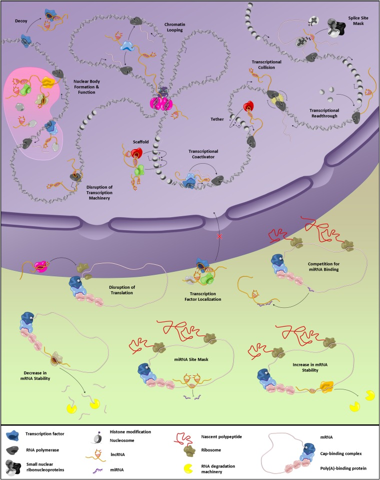

\pagebreak

# Acknowledgement

\pagebreak

# Abstract

#### Title

#### Intention
#### Research question 

#### Method
#### Results 
#### Conclusion 
#### Keywords 

\pagebreak

# Abbreviations

Eukaryotic translation initiation factor 4E-binding protein 1 (4E-BP1)

Focal adhesion kinase (FAK)

Growth arrest specific 5 (GAS5)

Long non coding RNA (lncRNA)

Mitogen-activated protein kinase (MAPK)

Muscle protein synthesis (MPS)

Mammalian target of rapamycin (mTOR)   

Mammalian target of rapamycin complex 1 (mTORC1)  

Mammalian target of rapamycin complex 2 (mTORC2)

Mitogen-activated protein kinase (MAP)

Mitogen-activated protein kinase kinase kinase (MAP3K)

Mitogen-activated protein kinase kinase (MAP2K)

Differentially expressed (DE)

Phosphatidic acid (PA)

Protein Kinase B (Akt)

quantitative /real time polymerase chain reaction (qPCR)

ribosomal protein S6K (p70S6K)

RNA component of mitochondrial RNA processing endoribonuclease (RMRP)

40S ribosomal protein S6 kinase (RSK)

\pagebreak

# 1. Theory

Humans are made for movement, and prolonged exercise training can enhance human exercise performance and help to maintain good health. Proper function of skeletal muscles are important for every aspect in life. Athletes need strong and enduring muscles to perform their best in competitions. Elderly people need strong muscles in the extremities to be able to walk across the road on green light, and to ascend stairs. Strong leg muscles are also important to prevent loss of balance and injury. When the muscles are exposed to mechanical stimuli, they adapt and becomes stronger or more persevering. Usually one tries to induce mechanical stimuli to the muscles with strength training. There are a vast number of different strength training programs and methods, but the two main variables are volume and intensity **kilde**. Volume is about sets, repetitions and number of training bouts. Intensity, on the other hand, is about load, speed and time. The training intensity is closely connected to increased muscle strength, and usually one finds large increase in muscle strength after high intensity training studies. How many sets and repetitions to apply, are a never ending discussion. The most used volume variables when performing strength training are probably 3 sets and 8-12 repetitions. The latter is a good starting point, but with manipulation of the volume variables one can gain even more muscle strength. What it all boils down to, is that musclegrowth and strength gain is highly correlated with the choices you do regarding volume and intensity. Much is known about the different strength training methods and how to maximize strength and muscle gain. Tailormade strength training bouts are big business, and are used for athletes, rehabilitation patients and exercisers alike. BUt little is known about what really happens when the muscle adapts to training. What are the rationales behind the small bashful changes in RNA expression, protein translation and other similar processes.

Different signalling pathways that leads to muscle adaptation after strength training have been identified. One of the most important to strength training adaptations is mammalian target of rapamycin (mTOR) **KIlde**. MTOR is a part of the phosphatidylinositol 3-kinase-related kinase family and has two distinct multi-protein complexes mtor c1 and c2. The former is recognized as the one most important to muscle adaptation. **KILDE**. We don't know much about the function of mtorc2, but it looks like it may be associated with the ribosome and regulating ribosomal activity, and cell survival **KILDE**.mTORC1 is targeting different signalling pathways and proteins, and is probably very important for muscle protein synthesis (MPS) **KILDE**. mTORc1 is activated by focal adhesion kinase (FAK) - Akt - mTOR- torc1- p70S6K. mTORC2 is downstream from FAK, Akt and upstream from eukaryotic translation initiation factor 4E-binding protein 1 (4E-BP1). Initiation of protein translation is activated by phosphatidic acid (PA), the latter activates mTORC1 and thereafter ribosomal protein S6K (p70S6K). Mechanical stress activates mitogen-activated protein kinase (MAPK), which can activate myc and phosphorylate C-myc. Regulates transcription factors and therby may regulate transcription of proteins **KILDE**. Little is known of proteins that regulates satellite cells. **Kilde** advocates that satellite cells are regulated by myostatin. Upregulated myostatin levels increases p21, a cyclin-dependent kinase inhibitor, and inhibits differentiation. Satellite cells, or muscle stem cells, are small cells that can evolve to sketelal muscle cells. When activated they can proliferate and transform to myoblasts **kilde**.  The latter can induce muscle fibre hypertrophy or make new muscle cells **kilde**. They are situated between the sarcolemma and membrane of the muscle fibre. Activated upon mechanical strain. Excercise triggers a cascade of different signaling molecules, e.g. growth factors and cytokines. HGF activates satellite cells, fibroblast growth factor (FGF) and insulin-like growth factor-I (IGF-1) increases proliferation.

RNa is a messenger between DNA and proteins. But in the transcriptional process a lot of non protein coding RNAs are produced [@Ponting2009]. One interesting transcript species are long non coding RNAs (lncRNAs). They are a bit of a mystery. For a long time they were solely regarded as transcriptional noise, but recently they are found interesting. **kilde**. The lncRNAs, as the name implies, is made up of over 200 nucleotides [@Ponting2009]. Little is known of their function and the evidence for lncRNAs function is scarce. But due to more advanced research methods, and higher interest the recent years, many lncRNAs has been identified and annotated. LncRNAs and their implication on muscle adaptation to strength training may be vast. Some is known, and cancer research advocates more research on lncRNAs. Especially the ones that are connected to tumor growth **KILDE**. Little is kown about the lncRNAs role in skeletal muscle adaptation to strength training. There may be some studies on mice, but in human skeletal muscle, the knowledge is scarce, if any.

## 1.1 Training volume and muscle growth
**Muskelvekst og treningsvolum (kan evt gjøres til to underdelkap – mulig rekkefølgen bør byttes om). Her skal du først få frem at det er et tydelig forhold mellom muskelvekst og treningsvolum. Fremhev at dette lenge var usikkert, men at meta-analyse viser dette** 

Strength training induces mechanical stimuli to skeletal muscles **Kilde** and the muscle adapts, among others, by adding sarcomeres in parallel in muscle fibres**Kilde**. Strength training results in neural adaptations, improved strength, alter muscle phenotype. and increased cross sectional area (CSA) of the muscle fiber **KILDE[@Staron1990]**. INcreased RFD (rate of increase in force at the contraction onset)  **KILDE**. Other adaptations to strength training is increased CSA, specially IIa fibres, increase in noncontractile tissue, e.g collagen, and change in muscle fibers angle of pennation. **KILDE**Adaptations to strength training shows after 8-12 weeks of repeated training**[@Folland2007]**. Over time, the strength gain will be more due to muscle growth than neural adaptations **kilde**. There will be an increase in muscle net protein synthesis (MPS) **KIlde [@Damas2015]**. MPS is increased due to lower protein degradation and higher, maybe more efficient, protein synthesis **kilde[@Phillips1997]**

Beginners have low hypertrophy effect from strength training, and the strength gain mostly comes from neural adaptations to muscle activation **kilde**. Adaptation to strength training is an individual response and everything are not identified or understood yet. What is known, is that one can vary load and volume to target either CSA or neuromuscular drive **KILDE**. One usually vary the load between 1RM and 10RM, and the volume between 4-12 repetitions.

The central neural component is important for muscle adaptations due to strength training, especially with unilateral training. With the latter the CSA in the untrained leg does not change, but one can observe an increase in strength **KILDE[@Munn2004]**.

**få deretter frem at dette er tydelig i intrabiologiskemodeller (og hvorfor). Hvorfor **
Systems biology is collaboration across different research fields and sciences[@Hester2011]. In need of multilevel studies to make a "Human Model". Trying to collect data from e.g. biology, physiology and bioscience to predict how the human body responds and adapts to various stimuli.

## 1.2 Cellular pathways
**fokus på cellulære pathways som antas å kontrollere muskelvekst (ie. Gjennom reg av translasjon og satelittcelleprolif) – her skal du konsentrere deg om pathways som senere skal brukes aktivt i diskusjon rundt betydningene av LNCs – du skal altså etablere en rød tråd – informasjonen begrenses således til generell oversikt samt perspektiver som påvirkes av LNCs**

Increase in mRNA expression after bout of strength training, drives protein synthesis of specific proteins **Barres et al. KILDE**
adaptive hypertrophy mainly driven by MPS (muscle protein synthesis) after activation of mTOR, ribosomal protein S6K (p70) and downstream variables **KILDE[@Bodine2001])**.

Translation of ribosome and the making of proteins is the key to muscle growth. Translation depends on two variables, translation capacity and translation efficiency. Translation capacity is all about how many ribosome are available, tRNA and translation factors **KIlde [Chaillou2014]**. And translation efficiency is how efficient the ribosome does the protein synthesis **KILDE**. Increase in the latter is likely one of the main variables  behind elevated MPS as a response to strength training. **KIlde[@O'Neil2009]**.

mTorC1 activity is regulated by several upstream regulators. One of them is phosphoinositide 3-kinase (PI3K), that again regulates protein kinase B (Akt) **KILDE[@Bodine2001]**. Mechanical stimuli leads to that Insulin-like growth factor 1 (IGF-1) binds to receptors in the cell membrane, and this initiate stimulation of PI3K- and Akt-activity **KILDE[@McCarthy2010]** AKT phosporylates downstream effectors and that activates G-protein Rheb (Ras-homolog enriched in brain) and that again activates mTORC1 

Amino acids and mechanical stimuli upregulates mtorc1. **KILDE**
mTORC1 phosphorylates 4E-BP1 and S6K1 which eventually leads to enhanced protein synthesis **KILDE**

Increase in mtorc1 activity after strength training -> signalling through a P13K/Akt independent RXRxxS/T kinase **KILDE**

Rapamycin binds to the FKBP12-rapamycin binding domain (FRB) and by doing that inhibits mtorc1. That results in inhibited cell proliferation and muscle hypertrophy.  **KILDE**

Mtorc1 is said to be driving the ribosomal biogenesis, but the mechanisme is not yet understood **KILDE**.

 

Ras is activated when extracellular mitogen binds to the membrane receptor. Followed by activation of Mitogen-activated protein kinase kinase kinase(MAP3K), Mitogen-activated protein kinase kinase (MAP2K) and Mitogen-activated protein kinase (MAP). The latter can then activate Myc, or other transcription factors **kilde**. Induce cell growth and proliferation.

MAPK can influence the translation of mRNA. It phosporylates 40S ribosomal protein S6 kinase (RSK), downstream is ribosomal protein S6. MAPK is upstrem for C-myc **kilde**  

**stress response p53?**

## 1.3 Long non-coding RNA

  
### 1.3.1  
  **o	 LNCs generelt, hva er de? Hvorfor vet vi så lite? Generelle funksjoner og nomenklatur/kategorier**

In the early 1990s, **kilde(Brannan et al. 1990) ** discovered that the lncRNA H19 was involved in egigentic regulation. Later, many more lncRNAs has been identified and described. Their function in epigenetic regulation are still eluded, but some of them are well known. Some of the lncRNAs can alter the coding gene by pairing with mRNA **kilde[@Wang2016]**, and other can interact with microRNAs and  make them miss their target mRNA **kilde[@Cesana2011]**. Yet another group of lncRNAs can encode micropetides that are shorter than 100 amino acids and by doing that alter the micropeptide induced functions **kilde[@Anderson2015]**. Lncrnas have a hefty toolbox to use, and most of the lncs directly linked to myogenesis acts as transcriptional or epigenetic regulators [@Li2018].

LncRNAs can be allocated to five categories:
1) sense, 2) antisense, 3)bidirectional, 4)intronic and 5)intergenic [@Ponting2009].
In the first category they overlap one or more exons of another exon on the same strand. The second is the same as the first, except the lncRNA is on the opposite strand. In the third category, the lncRNA is in close genomic proximity to a coding transcript on the opposite strand. The fourth is when it is derived from an intron on a second transcript, and the fifth is when it is in the genomic interval between two different genes. Some of the lncRNAs functions can be seen in figure **?**.
  
  **Figure from [@Kung2013] shows some of the lncRNAs functions

  
### 1.3.2
  
 **cell growth and proliferation**
 
 **cancer research**

One has discovered that lncRNAs may regulate satellite cell biology [@Li2018]. Satellite cells are important for muscle regeneration.  If an injury occurs, the satellite cells will be activated and become myoblasts. Pax7 is downregulated and myogenic regulatory factors (MRFs) are activated to start cell differentiation, thereby making new muscle fibers and replenish the damaged muscle cells **kilde[@Kuang2007]**. Another important feature for the lncRNAs is that they play a role in epigenetic and transcriptional regulation of chromatins. The Lncs interacts with chromatins, and may inhibit other transcriptional regulators activities **kilde[@Han2014]**.

Some of the lncRNAs can alter the coding gene by pairing with mRNA **kilde[@Wang2016]**, and other can interact with microRNAs and  make them miss their target mRNA **kilde[@Cesana2011]**. Yet another group of lncRNAs can encode micropetides that are shorter than 100 amino acids and by doing that alter the micropeptide induced functions **kilde[@Anderson2015]**. Lncrnas have a hefty toolbox to use, and most of the lncs directly linked to myogenesis acts as transcriptional or epigenetic regulators [@Li2018].

**animal studies, may use SYISL?** In mice, lncRNA SYISL interacts with polycomb repressive complex 2 and regulates myogenesis **kilde* It's human morfolog is lncRNA AK021986, but no ensemble ID has been allocated and the latter is therefore removed from the qPCR analysis.

Some of the known lncRNAs and their function
The lncRNA Growth arrest specific 5 (GAS5) supresses MYC translation **kilde** (Parrot/LINP1) is a positive regulator of c-Myc and ribosomal biogenesis **kilde**. (PVT1) is activated in the early phase of muscle atrophy. PVT1 alter mitochondrial respiration, myofiber size, apoptosis and mito/autophagy**kilde**. RNA component of mitochondrial RNA processing endoribonuclease (RMRP) alters the transport trough the mitochondrial membrane **kilde**. (Linc-MD1) has many functions related to muscle adaptations. It regulates myogenic differentiation, myogenesis and hypertrophy. Linc-MD1 downregulates myogenic markers when depleted. It is reported to influence the mRNA levels of miRNA-targeted muscle differentiation genes, by and blocking the target mRNA for miR-133 and miR-135 [@Cesana2011].
  
  

  
### 1.3.3  

  **o	hvordan kan vi studerer LNCs in vivo hos mennesker? Først må uttrykksomfanget kartlegges. RNA-seq vs qPCR . Få frem at ikke alle LNCs har poly-A hale, noe som er nødvendig dersom de skal plukkes opp i poly-A drevet RNAseq (poenget er å forberede leseren på at du kun gjenfinner 6 av linkene fra qPCR-exp i RNA-seq datasettet  - dette er en av mulige forklaringer – sekvenseringsdybde er en annen)**

How to study lncRNAs in human genome? How many lncRNAs can be identified in the human muscle cells, and are they differentially expressed on different timepoints.

Discovery and characterization of lncRNAs has sped up due to the recent years leap in high throughput gene sequencing technology. 

High throughput gene sequencing technology [@Reuter2015]

Use qPCR or RNA seq. Which one is best. RNA seq yields massive data. 

Not all lncRNA has poly A tail. This is essential to be able to sequence. @Sun2016 defined 7692 lncRNAs in bovine skeletal muscle using Ribo_Zero RNA-seq. This sequencing technology can identify both poly A+ and poly A- transcripts. A poly A tail consists of many adenosine monophosphates and helps preventing degradation of mRNA **KIlde** LncRNAs have usually low expression and are highly tissue specific. They usually have a poly A+ or poly A- tail at thee 3' end of the transcript. **kilde[@Cabili2011]**

Only six of the nine lncRNAs that underwent qPCR analysis was recognized in the sequence data.

sequencing depth

The lack of knowledge on how lncRNAs adapts to mechanical stimuli, strength training, in human muscle, advocates further research on the topic. The goal of this study was to explore and identify lncRNAs in human muscle cells. The research questions are as follows:
1) How manye lncRNAs can be idetified from the rna sequence data.
2) How many differentially expressed (DE) lncRNAs can be identified from gene sequencing data pool after a strength training bout.
3) How many DE lncRNAS increases?
4) How many DE lncRNAS decreases
5) How many of the lncRNAs have GO code (gene ontology), are annotated
6) Is there a correlation between qPCR data and seq. data.

\pagebreak

# Introduction
Muscle growth and strength gain, is what one seeks when enduring long hours at the gym lifting heavy weights. But what happens inside the muscle? And why is there a difference between how people adapts to the same strength training. Much is known about how and why one should perform strength training. But wouldn't it be nice if one could predict the muscle adaptations?

Translation, from mRNA to proteins is a fairly straight forward process. But lately one have looked at a sub species called long non coding RNA (lncRNA). LncRNA has been depreciated as nothing more than transcriptional noise. But lately there has been a change towards a more functional approach. LncRNA react different dependent on tissue and cells **kilde**. If it was only ¨noise, then it should be indifferent.

Cancer research has identified and described many different lncRNAs. Especially the ones that are connected to tumor and cell growth. 

In this study 9 intersecting lncRNAs were analysed with qPCR. Gene sequencing data was also obtained and analysed together with qPCR data. Gene sequencing data is an vast pool and this is an exploratory study.  

The lack of knowledge on how lncRNAs adapts to mechanical stimuli, strength training, in human muscle, advocates further research on the topic. The goal of this study was to explore and identify lncRNAs in human muscle cells. The research questions are as follows:
1) How manye lncRNAs can be idetified from the rna sequence data.
2) How many differentially expressed (DE) lncRNAs can be identified from gene sequencing data pool after a strength training bout.
3) How many DE lncRNAS increases?
4) How many DE lncRNAS decreases
5) How many of the lncRNAs have GO code (gene ontology), are annotated
6) Is there a correlation between qPCR data and seq. data.

# Methods
This study is based on the 1/3 set study completed by Hammarström et al. [@Hammarström2020].

## Ethical approval
Information about potential discomforts and risks associated with the study were given to all the participants and they gave their informed consent before study enrolment. All procedures were performed in accordance to the Declaration of Helsinki. The study design was pre-registered (ClinicalTrials.gov Identifier: NCT02179307) and approved by the local ethics committee at Lillehammer University College, Department of Sport Science (no. 2013-11-22:2).

## Intervention and participants overview **lag figur som viser oversikt over intervensjonen – se hammarstrom et al 2020**

41 female and male participants were recruited to the study. The eligibility criteria were age between 18 and 40 years and non-smoking. The exclusion criteria were impaired muscle strength due to ongoing or previous injury, prescribed medicine that could alter exercise adaptations, more than one strength exercise bout weekly during the last 12 months or local anaesthetic intolerance. 7 participants were excluded during data analysis due to different reasons. Details can be found in Hammarstroms article **KILDE**
  The intervention was made up by 12 weeks of full-body strength training.
Within-participants differentiation of training volume was achieved by doing unilaterally leg exercises. The strength-training consisted of one set and three set exercises, and the exercise was randomly allocated to the participants two legs. Assessment of muscle strength was performed at baseline and week 3, 5, 9 and after the intervention. Body composition was assessed before and after the intervention and dietary data was **SELVANGITT** after 4-5 following days after week 6. M.vastus lateralis biopsies were taken at the following 4 different timepoints bilaterally: week 0 (rested state), week 2 (pre-exercise), week 2 (post-exercise, acute-phase) and week 12 (rested state).
The detailed study protocol can be found in Hammarstroms article **KILDE**
 
 

## Training protocol
The training bouts always started with 5 min of ergometer cycling with Borgs RPE 12-14 as a warm up.Thereafter 4 bodyweight exercises (sit-ups, push-ups, back-extensions and squats) with 10 repetitions each. Followed by 10 reps at 50% of 1 repetitions maximum (1RM) for each strength exercise. Thereafter unilateral leg press, leg curl and knee extension either as one set or three sets for the latter. After the lower leg exercises they performed two sets of pull-down, seated rowing or shoulder-press and bench press. The intensity was progressed from 10RM (2 weeks), 8RM (3 weeks) to 7RM (7weeks). The rest period between the latter sets was 90-180 seconds. For more details see Hammarstroms article **KILDE**

## Muscle biopsies
The muscle biopsies were taken, within 10 minutes, bilaterally from m. vastus lateralis using a spring-loaded biopsy instrument (Bard Magnum, Bard, Rud, Norway) with a 12-gauge needle (Universal-plus, Medax, San Possidonio, Italy). Local anaesthetics (Xylocaine, 10 mg ml−1 with adrenaline 5µgml−1, AstraZeneca AS,Oslo,Norway) was used during the latter protocol. The resting samples were taken after a standardised meal, at the same timepoint in the morning. Biopsies pre exercise (5 session) was taken 2 days after the 4th session. Post exercise biopsies were taken 3-6 days after intervention ended. Patella and spina iliaca anterior superior (SIAS) was used as landmarks, and the first biopsy was taken from 1/3 of the latter distance. Consecutive biopsies were taken 2 cm proximal to the latter sample. Ice cold saline solution (0,9%) was used when dissecting the muscle samples free from connective tissue and blood. Thereafter 15mg muscle tissue were moved to 4% formalin solution for later immunohistochemistry testing. The muscle tissue (60 mg) that were to be used in RNA- and protein-analysis were quickly frozen in isopentane and stored at -80 degrees Celsius   

## Total RNA extraction
RNA extraction was done in accordance with the protocol found in Hammarstrom article **KILDE**

## Quantitative real-time reverse transcription polymerase chain reaction (QPCR)
The protocol was done in accordance to the protocol from **KILDE**
The qPCR was done with a qPCR machine (Applied Biosystems 7500 fast Real-Time PCR Systems, Life Technologies AS). Used 384 well plates filled with total 10 µl solution. The latter consisting of 2 µl cDNA, specific primers (Forward and Reverse, total 1µl), H20 and a prepared master mix (2X SYBR Select Master Mix, Applied Biosystems, Life Technologies AS). The qPCR protocol was 40 cycles (3 s 95°C denaturing and 30 s 60°C annealing)**?**
Primertest were performed and the primers with the best melt-curves was selected (single product amplification)

### Overview of primers used.

Parrot_F1R1/LINP1 annotated with LINP1

AKO21986_F3R3 was sorted out because does not have ensemble number.

Primers were designed for all selected long non coding RNAs (LINCs) with Primer3Plus **(Untergasser et al. 2012)** and ordered from Thermo Scientific.

Raw data was exported from the qPCR machine and uploaded to RStudio and analysed with the qpcR-package (Ritz & Spiess, 2008) written for R (R Core Team, 2018). Treshold cycles (Ct) were estimated within the latter. Gene expression data were log-transformed prior to statistical analysis

seq data. Biomart, and other packages.

## Statistics

Mixed-effects negative binomial count models were fitted and saved in 
./R/dge_list_models.R. Results saved in RDS files

-validation seq data
-correlation seq data-qpcr data fold-change, baseline values.

-PCR vs seq data use fold/change mean values

-normalization seq and qpcr data

-linear mixed-effects models (LMMs)

-likelihood-ratio (LHR) tests

-present as mean and SD

-LMMs were fitted using the nlme-package

-statistical significance was set to α = 0.05. 

-All data-analysis was done in R (R Core Team, 2018).

All files and code can be found at github.com "Innlevering_masteroppgave"

Method paper (Hammarstr��t al 2018), the fixed effects are reduced
to only contain gene-specific time + time:sets

VOLCANO plot

# Results

**gangen gjennom results blir som følger (skriv som sammenhengende historie):**

 **RNA-seq (se oppbygning av results i hammarstrm et al RNA-seq draft**

In total 15025 were identified in the RNA sequencing data, and 1390 of them were identified as lncRNAs. LncRNAs were identified with BiomaRT R package and Ensemble ID. With this method is it not possible to find lncRNAs without Ensemble id. The latter applied to AKO21986, one of the qPCR lncRNAs and it was removed from the analysis.

Only 16 of the lncRNAs identified in the gene sequence data have entrezgene gene id number. Entrezgene ID is needed to perform a gene ontology analysis

**Få frem hva som fører til tildeling av entrezID**

#####entrez gene [@Maglott2011]

Entrez Gene is the gene-specific database at the NationalCenter for Biotechnology Information (NCBI), a divisionof the National Library of Medicine, located on the campusof the US National Institutes of Health in Bethesda, MD,USA. Entrez Gene generates unique integers (GeneID)as stable identifiers for genes and other loci for a subsetof model organisms. It tracks those identifiers and usesthem to integrate multiple types of information includingnomenclature, summary descriptions, accessions of gene-specific and gene product-specific sequences, chromosomallocalization, reports of pathways and protein interactions,associated markers and phenotypes. Because the GeneIDis used to represent gene-specific information in otherdatabases at NCBI, the full Entrez Gene report includes awealth  of  links  to  gene-specific  literature  citations,sequences, variations, homologs and databases outside ofNCBI. Entrez Gene is integrated with NCBI’s Entrezsystem for interactive query, Linkout and access byE-Utilities (1).Data in Entrez Gene result from integration of resultsfrom automated analyses and curation by ReferenceSequence project (RefSeq) staff. Gene-specific annotationin sequences from NCBI’s RefSeq (2) or the InternationalNucleotide Sequence Database Collaboration (INSDC)(3) usually serves as the foundation, with value addedby with information from collaborating model organismdatabases, public users and literature review (especiallythe  Gene  References  into  Function  or  GeneRIFssubmitted  by  the  public  and  staff  of  the  NationalLibrary of Medicine). Updates are posted daily, and cor-rections or suggestions are welcomed (http://www.ncbi.nlm.nih.gov/RefSeq/update.cgi

Of the 1390 lncRNAs, 114 changed at 2 weeks rest, 76 at 2weeks acute and 82 at 12 weeeks rested state with moderate training volume. With low volme 686, 544 and 432 changed respectively.

At week 2 rested state, 94 increased and 20 decreased with moderate volume. With low volume 634 increased and 52 decreased.

At week 2 post training 31 increased and 45 decreased with moderate volume. With low volume 196 increased and 348 decreased.

At week 12, 51 increased and 31 decreased with moderate volume. With low volume 428 increased and 4 decreased.

##DE lncRNAs both acute and rest

## quantitative /real time polymerase chain reaction (qPCR):

9 lncRNAs that have previously been linked to muscle plasticity/growth.were used in qPCR analysis. Of the latter, 6 were identified in the RNA sequencing data.

ENSG00000185847	LINC01405
ENSG00000223784	LINP1
ENSG00000225613	LINCMD1
ENSG00000234741	GAS5
ENSG00000268518		
ENSG00000269900	RMRP

For moderate training volume 3 lncRNAs changed significantly, 2 increased and 1 decreased at timepoint w2pre.

At timepoint w2post 4 changed, of wich 3 increased and 2 decreased.

At timepoint w12, 3 changed, 3 increased and 0 decreased.

With low training volume 1 changed at rested state timepoint w2pre, 1 increased and 0 decreased. At timepoint w2post, 1 changed, 0 increased and 1 decreased.

At timepoint w12 rested state 0 lncRNAs changed significantly.

**•	sammenligning moderat vs lavt volum – hvor mange LNCs responderte ulikt på de to treningsmod ved hvert av de tre tidspunktene?**

**•	Hvilke endret seg ved hvert av de tre tidspunktene? Prøv å få til en samlende historie, med fokus på gener som endrer seg, inkl retning og fold-change. For de andre, holder det å skrive at de ikke endret seg**

**•	Var det forskjell mellom moderat og lavt volum? Ideelt sett skrives dette sammen med info fra foregående punkt – igjen tenk rød tråd og historie RNA-seq vs qPCR** 

**lage én figur som fremviser korrelasjon (mellom per mg uttrykk RNA-seq og per-mg-uttrykk-qPCR)? Bryte dataene ned til individer? Dvs  lage et korrelasjonsplot for samtlige individer og gener? Evt et plot per gen. Disse dataene kan evt presenteres i tabellform -  poenget er å vise frem at dataene er reliable**

**-	Btw, det ser ut til at et av genene har avvikende results i foreliggende figs – dette kan tyde på metodiske problemer knyttet til enten RNA-seq eller qPCr – sjekk qPCR-kjøringene**
 Only applies to rested state models. 

**lncRNAs identified as DE**

***rest***
543 lncRNAs were identified as differentially expressed when analysed from pre training to w12. The biopsies were taken in rested state.

***acute***
385 lncRNAs were identified as differentially expressed directly after a training bout at timepoint w2post.

**lncRNAs DE increase/decrease**

`504 of the differentially expressed lncRNAs at rest increased, and 39 decreased.

For the acute analysis 146 lncrNAs increased and 239 decreased. Of the qPCR lncRNAs ENSG00000185847, ENSG00000223784, ENSG00000225613, ENSG00000234741 and ENSG00000268518 were differentially expressed at rest and ENSG00000223784, ENSG00000225613 and ENSG00000234741 differentially expressed after the acute analysis.

 

## Fold change qPCR and seq data

# Discussion

Start diskusjonen med ett avsnitt som summerer opp nyhetsverdien i datasettet (uten på gjenta results). Plassér funnen i relasjon til litteraturen. Har dette blitt gjort før? Samsvarer resultatene? Ha fokus på mod vs lavt volum, med skrpåblikk på effekter av tid. Ta for deg data fra spesielt interessant LINCs (enten med hht tidligere forskning, som for eksempel MD1, eller med hht RNA-se dataene, eg knyttet til p-verdi, fold-change eller genefunksjonsanalyser) – fremhev at MD1 støtter oppunder tidligere forskning som indikerer mulig rolle i muskelbiologi – fremhev at andre gener assosieres med muskelfunksjon (og volum eller tid) for første gang. Diskusjonen deles deretter inni følgende temaer (som alle, foruten det siste, henger sammen med info i dette første avsnittet):
1)	LNCs og deres tilstedeværelse I muskel – 1390 LNCS – hvordan samsvarer dette med dyrestudier? Det store antallet uttrykte gener og og det store antallet som endrer seg indikerer at LNCS spiller viktige roller i msukelfysiologi 
2)	Volum-avhengige LNC-responser? Fremhev det store bildet – viste noen av genene differensielle responser mellom conditions? Hvis ja, kan vi si noe om betydning for muskelbiologi? Hvis nei, henvis til RNA-seq-paperet til hammarstrøm, som indikerer at responser på ett og tre-sett trening er svært like – NB vi brukte intrabiologisk treningsmodell – gir oss god oppløsning – gode korrelasjoner i RNA-seq datasettet mellom repeated samples (i.e. kontralaterale samples)
3)	Tids-effekter LNC-responser. Mange endret seg (utgjør xx % av alle gener som endret uttrykk). Diskutere spesielt interessante gener i detalj (som fremhevet i diskusjonens første avsnitt) – kan vi si noe om biologiske effekter? Bruk gjerne litteratur på andre vevsmodeller enn muskel
4)	Metodiske utfordringer og fremtidige perspektiver

Is it more to lncRNAs than just transcriptional noise?

Few lncRNAs with entrezgene ID, linked to gene ontology

LncRNA Differentially expressed in muscle tissue

Why does some of the lncRNas increase with strength training and other decrease.

Is there a difference between sets, if so, why?

correlation between qPCR and gene sequencing.

How can lncRNA alter/have an influence on adaptation to strength training

Is it possible to use lncRNA expression to make a model to predict how the muscle adapts to strength training.

How to normalise sequencing data? In this paper it was used two different approaches. Normalized by lib size and normalizing by tissue weight.
**Focuser på en – dvs bruk tissue-offset – du trenger i utgangspunktet ikke diskutere dette**

# Conclusion

# Apendix

\pagebreak

# References

